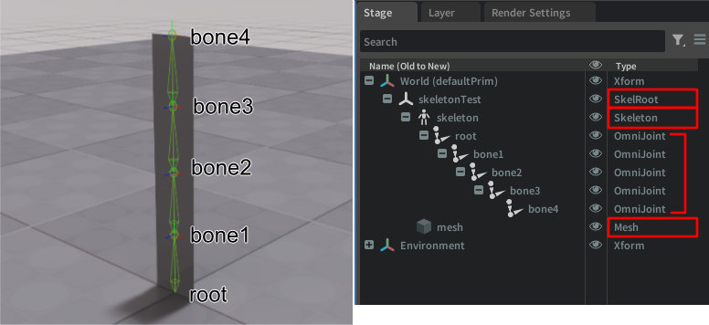
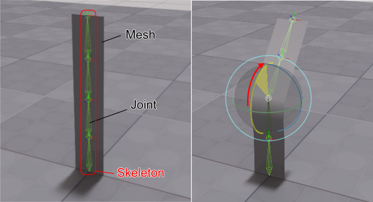
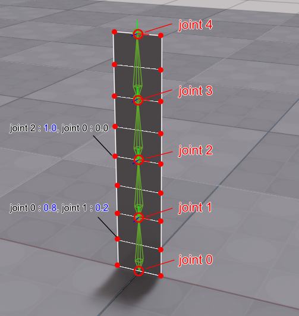

# スケルトンの構造とスキン

参考のソースコード : [SkeletonSkin.py](./SkeletonSkin.py)

USDのスケルトン構造は次のようになっています。  

  

SkelRootから開始します。その子primにSkeletonがあります。  
上記のキャプチャではOmniJointを使ってSkeletonのジョイント構造が可視化されていますが、これはOmniverseが自動的に作成した一時的なprimです。  
USD構造ではこのOmniJointは存在しません。  

また、スキンを割り当てているメッシュはSkeleton内に配置する必要があります。  

## usdaに出力

[SkeletonSkin.py](./SkeletonSkin.py)を実行し、usdaファイルを出力すると以下のようになっています。  
```
def Xform "World"
{
    def SkelRoot "skeletonTest"
    {
        def Skeleton "skeleton"
        {
            uniform matrix4d[] bindTransforms = [( (1, 0, 0, 0), (0, 1, 0, 0), (0, 0, 1, 0), (0, 0, 0, 1) ), ( (1, 0, 0, 0), (0, 1, 0, 0), (0, 0, 1, 0), (0, 25, 0, 1) ), ( (1, 0, 0, 0), (0, 1, 0, 0), (0, 0, 1, 0), (0, 50, 0, 1) ), ( (1, 0, 0, 0), (0, 1, 0, 0), (0, 0, 1, 0), (0, 75, 0, 1) ), ( (1, 0, 0, 0), (0, 1, 0, 0), (0, 0, 1, 0), (0, 100, 0, 1) )]
            uniform token[] joints = ["root", "root/bone1", "root/bone1/bone2", "root/bone1/bone2/bone3", "root/bone1/bone2/bone3/bone4"]
            uniform matrix4d[] restTransforms = [( (1, 0, 0, 0), (0, 1, 0, 0), (0, 0, 1, 0), (0, 0, 0, 1) ), ( (1, 0, 0, 0), (0, 1, 0, 0), (0, 0, 1, 0), (0, 25, 0, 1) ), ( (1, 0, 0, 0), (0, 1, 0, 0), (0, 0, 1, 0), (0, 25, 0, 1) ), ( (1, 0, 0, 0), (0, 1, 0, 0), (0, 0, 1, 0), (0, 25, 0, 1) ), ( (1, 0, 0, 0), (0, 1, 0, 0), (0, 0, 1, 0), (0, 25, 0, 1) )]
        }

        def Mesh "mesh" (
            prepend apiSchemas = ["SkelBindingAPI"]
        )
        {
            float3[] extent = [(-10, 0, 0), (10, 100, 0)]
            int[] faceVertexCounts = [4, 4, 4, 4, 4, 4, 4, 4]
            int[] faceVertexIndices = [0, 1, 3, 2, 2, 3, 5, 4, 4, 5, 7, 6, 6, 7, 9, 8, 8, 9, 11, 10, 10, 11, 13, 12, 12, 13, 15, 14, 14, 15, 17, 16]
            normal3f[] normals = [(0, 0, 1), (0, 0, 1), (0, 0, 1), (0, 0, 1), (0, 0, 1), (0, 0, 1), (0, 0, 1), (0, 0, 1), (0, 0, 1), (0, 0, 1), (0, 0, 1), (0, 0, 1), (0, 0, 1), (0, 0, 1), (0, 0, 1), (0, 0, 1), (0, 0, 1), (0, 0, 1)] (
                interpolation = "vertex"
            )
            point3f[] points = [(-10, 0, 0), (10, 0, 0), (-10, 12.5, 0), (10, 12.5, 0), (-10, 25, 0), (10, 25, 0), (-10, 37.5, 0), (10, 37.5, 0), (-10, 50, 0), (10, 50, 0), (-10, 62.5, 0), (10, 62.5, 0), (-10, 75, 0), (10, 75, 0), (-10, 87.5, 0), (10, 87.5, 0), (-10, 100, 0), (10, 100, 0)]
            int[] primvars:skel:jointIndices = [0, 0, 0, 0, 0, 1, 0, 1, 1, 0, 1, 0, 1, 2, 1, 2, 2, 0, 2, 0, 2, 3, 2, 3, 3, 0, 3, 0, 3, 4, 3, 4, 4, 0, 4, 0] (
                elementSize = 2
                interpolation = "vertex"
            )
            float[] primvars:skel:jointWeights = [1, 0, 1, 0, 0.8, 0.2, 0.8, 0.2, 1, 0, 1, 0, 0.8, 0.2, 0.8, 0.2, 1, 0, 1, 0, 0.8, 0.2, 0.8, 0.2, 1, 0, 1, 0, 0.8, 0.2, 0.8, 0.2, 1, 0, 1, 0] (
                elementSize = 2
                interpolation = "vertex"
            )
            texCoord2f[] primvars:st = [(0, 0), (1, 0), (0, 0.125), (1, 0.125), (0, 0.25), (1, 0.25), (0, 0.375), (1, 0.375), (0, 0.5), (1, 0.5), (0, 0.625), (1, 0.625), (0, 0.75), (1, 0.75), (0, 0.875), (1, 0.875), (0, 1), (1, 1)] (
                interpolation = "vertex"
            )
            rel skel:skeleton = </World/skeletonTest/skeleton>
            uniform token subdivisionScheme = "none"
        }
    }
}
```

簡略化すると次のようになります。  
```
def Xform "World"
{
    def SkelRoot "skeletonTest"
    {
        def Skeleton "skeleton"
        {
            uniform matrix4d[] bindTransforms = [...]
            uniform token[] joints = ["root"...]
            uniform matrix4d[] restTransforms = [...]
        }

        def Mesh "mesh" (
            prepend apiSchemas = ["SkelBindingAPI"]
        )
        {
            float3[] extent = [...]
            int[] faceVertexCounts = [4, 4, 4, 4, 4, 4, 4, 4]
            int[] faceVertexIndices = [...]
            normal3f[] normals = [...] (
                interpolation = "vertex"
            )
            point3f[] points = [...]
            int[] primvars:skel:jointIndices = [...] (
                elementSize = 2
                interpolation = "vertex"
            )
            float[] primvars:skel:jointWeights = [...] (
                elementSize = 2
                interpolation = "vertex"
            )
            texCoord2f[] primvars:st = [...] (
                interpolation = "vertex"
            )
            rel skel:skeleton = </World/skeletonTest/skeleton>
            uniform token subdivisionScheme = "none"
        }
    }
}
```

以下のような階層構造になります。  
```
SkelRoot
  Skeleton
  mesh  
```

## スケルトンの構造

スケルトン構造は「スケルトン」と「メッシュ」で構成されます。  
このスケルトンとメッシュを関連付けるものが「スキン」です。  
スケルトンは複数の階層構造を持つ「ジョイント」（他ツールでは「ボーン」とも呼ばれる）で構成されます。  

  

スケルトンのジョイントを回転させると、スキンによって関連付けられたメッシュが変形することになります。  
このとき、メッシュはSkelRootの子として配置する必要があります。  
SkelRootの子の構造でXformを使った階層の先にメッシュを配置しても問題ありません。  

## スケルトン内でジョイントを構成する要素

**Skeletonのprimの属性** として、以下の3つの要素を格納します。  
「ジョイント構造はprimで指定していない」ことに注意してください。  


|属性名|タイプ|説明|  
|---|---|---|  
|joints|token[]|ジョイント名のリスト|  
|bindTransforms|matrix4d[]|Skeletonをベースにした変換行列|  
|restTransforms|matrix4d[]|ジョイントごとのローカルでの変換行列|  

それぞれの要素数はジョイント数と同じ数だけ指定します。  
また、ジョイント名はSkeletonのprimを基準にします。  
階層の区切りを"/"として指定します。  

usda上で次のように格納している場合。  
```
def SkelRoot "skeletonTest"
{
    def Skeleton "skeleton"
    {
        joints = ["root", "root/bone1", "root/bone1/bone2"]
    }
}
```

ジョイントは（仮想的に）以下のように構成されることになります。  
```
skeletonTest
  skeleton
    root
      bone1
        bone2
```

## スキン

メッシュの各頂点ごとにジョイントがどれくらいの影響を与えるかをウエイト値として指定します。  
これがスキン情報になります。  
  

Skeletonのprimで指定したjoints配列の順番ごとに0からはじまるインデックスで表します。  
上の画像の場合、ジョイントは5つあります。  
また、頂点ごとに2つのウエイト値を指定しています。このとき頂点ごとにいくつのジョイントから影響を受けるかの数も指定できます。  
一般的には1つの頂点に対するジョイントのウエイト値の合計を1.0にすることが多いです。  

スキン情報としてメッシュごとに以下の属性を持ちます。  

|属性名|タイプ|説明|  
|---|---|---|  
|primvars:skel:jointIndices|int[]|メッシュの頂点ごとのジョイントインデックス|  
|primvars:skel:jointWeights|float[]|メッシュの頂点ごとのウエイト値|  

ともにelementSizeを指定することになります。これは、頂点ごとに影響を与えるジョイント数です。  
1つの頂点に対して2～4ジョイントのウエイト値を指定することが多いかもしれません。  
jointIndicesとjointWeightsの要素数は 頂点数 *
 elementSize分指定します。  

### メッシュのスキンを参照するスケルトンを関連付け

Skeletonのprimに対するスケルトン（ジョイントの階層構造）の指定、Meshのprimに対するスキンの指定がこれでできました。  

Meshで次の指定をすることにより、skeletonで示されるスケルトンのprimに対して関連付けます。  
```
bindingAPI = UsdSkel.BindingAPI(prim)
bindingAPI.CreateSkeletonRel().SetTargets([skeleton.GetPath()])
bindingAPI.Apply(prim)
```
