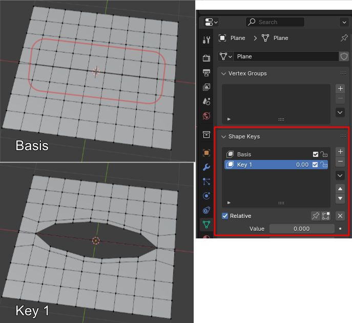
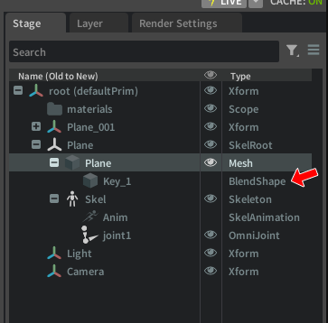
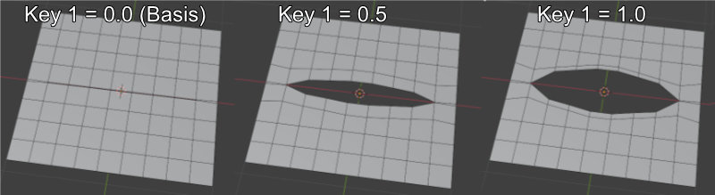
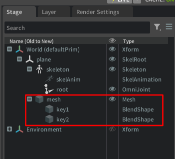

# BlendShape

参考のソースコード : [SkeletonSkinBlendShape.py](./SkeletonSkinBlendShape.py)

UsdSkelBlendShape :  
https://openusd.org/docs/api/class_usd_skel_blend_shape.html  


メッシュの頂点を移動させて変形やアニメーションを行う機能がBlendShapeです。   
人の顔の表情や目の開閉など、スキン＋ボーン(ジョイント)で表現が難しい動きはBlendShapeを使うほうが効率がいいです。    

## BlendShapeとは？

Blender上での簡単な例で説明します。  
BlendShapeはメッシュの複数の指定の頂点がどれくらい移動するか、という情報をBlenderの場合は"Shape Key"として持つことができます。  
以下はBlenderの画面です。  
  

USDではこの単語は使われていないようでした。  
USDでは"Shape Key"に対応するPrimが"BlendShape"になっています。  
以下はUSD Composerの画面です。  
  

BlendShape Primはメッシュの子として配置され、メッシュの対応する頂点インデックスと移動量（Offset）が配列で指定されています。  

このShape Key(BlendShape)に対して、0.0-1.0の間のウエイト値を指定できます。  
これはアニメーションのキーフレームとしても指定できます。  
これにより、元のBasisの頂点位置から指定のShape Keyのオフセット位置まで線形で変形します。  
  

また、複数のShape Keyにウエイトをそれぞれ与えることで複数の変形の結果を合成することもできます（同一メッシュ内の目の開閉と口の開閉を別々のShape Keyで管理するなど）。  

## USDでBlendShapeを使用する

「[SkeletonSkinBlendShape.py](./SkeletonSkinBlendShape.py)」を例として説明します。  
BlendShapeはSkeleton構造を使う必要があります。  
「[SkelAnimationでポーズを与える](./SkeletonSkinPose.md)」もご参照くださいませ。  

次のような構成になります。  
```
SkelRoot
  Skeleton
    SkelAnimation
  Mesh
    BlendShape
```

Skeleton内のジョイントは"root"のみを与えています。  
ジョイントは用意していますがスキンは未使用のため、スキンが与えるメッシュの頂点ごとのウエイト値は指定していません。  

メッシュに対して2つのBlendShape(Shape Key)を与えました。  
  
個々のShape Keyに相当するBlendShapeのデータはこのPrimに格納します。  


## BlendShapeの作成

BlendShapeは以下の要素を指定できます。  

|Attribute名|型|説明|  
|---|---|---|  
|PointIndices|intの配列|メッシュの頂点インデックス|  
|Offsets|Gf.Vec3fの配列|頂点の移動量|  
|NormalOffsets|Gf.Vec3fの配列|法線ベクトルの移動量|  

PointIndicesで指定した要素数と同じ数だけOffsetsやNormalOffsetsの配列要素を指定します。  
OffsetsとNormalOffsetsはベースの位置からの移動量になります。  
OffsetsのデフォルトはGf.Vec3f(0, 0, 0)、NormalOffsetsのデフォルトはGf.Vec3f(0, 0, 1)です。  
移動だけで変形を表したい場合は、NormalOffsetsを省略できます。  

