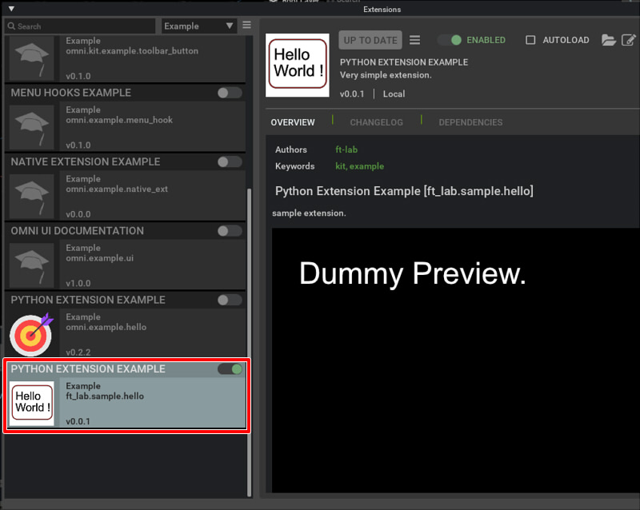

# ft_lab.sample.hello

"ft_lab.sample.hello" はExtensionの簡単なサンプルです。    
"omni.example.hello"を参考にしました。    

## Extensionの構成

"ft_lab.sample.hello" Extensionの構成です。     

```
[ft_lab.sample.hello]
    [config]
        extension.toml

    [data]
        icon.png      ... Icon file (256 x 256 pixel).
        preview.png

    [docs]
        CHANGELOG.md
        index.rst
        README.md

    [ft_lab]
        [sample]
            [hello]
                __init__.py
                hello.py
```

## data/icon.png

アイコンファイル(256 x 256 pixel)。    
"config/extension.toml"から参照されます。    

## data/preview.png

ExtensionウィンドウのOVERVIEWで表示される画像です。      
"config/extension.toml"から参照されます。    

## docs

ドキュメント。     

|ファイル名|説明|     
|---|---|     
|index.rst|ドキュメントの構造を記載したファイル。|     
|README.md|OVERVIEWに表示される内容。|     
|CHANGELOG.md|CHANGELOGに表示される内容。|     

### index.rst

```
ft_lab.sample.hello
###########################

.. toctree::
   :maxdepth: 1

   README
   CHANGELOG
```
## config/extension.toml

"extension.toml"はExtentionの設定を記載します。     

```
[package]
# Version.
version = "0.0.1"

# Authors.
authors = ["ft-lab"]

# The title and description.
title = "Python Extension Example"
description="xxxxxx."

# Path (relative to the root) or content of readme markdown file for UI.
readme  = "docs/README.md"

# URL of the extension source repository.
repository = ""

# One of categories for UI.
category = "Example"

# Keywords for the extension
keywords = ["kit", "example"]

# ChangeLog.
changelog="docs/CHANGELOG.md"

# Preview image.
preview_image = "data/preview.png"

# Icon image (256x256).
icon = "data/icon.png"

# We only depend on testing framework currently:
[dependencies]

# Main python module this extension provides.
[[python.module]]
name = "ft_lab.sample.hello"
```

## ft_lab.sample.hello

"ft_lab.sample.hello"内は、"ft_lab/sample/hello"の階層でフォルダを構成します。     
```
[ft_lab]
    [sample]
        [hello]
            __init__.py
            hello.py
```

### __init__.py

開始するメインファイル (hello.py)のインポートを指定します.     

```
from .hello import *
```

### hello.py

Extensionの開始時と終了時に呼び出すメソッドを指定します。     
```
import omni.ext

class HelloExtension(omni.ext.IExt):
    # Call startup.
    def on_startup(self, ext_id):
        print("[ft_lab.sample.hello] HelloExtension startup")

    # Call shutdown.
    def on_shutdown(self):
        print("[ft_lab.sample.hello] HelloExtension shutdown")
```

このときのクラス名"HelloExtension"はどのような名前でも認識されるようでした。     
"on_startup"でExtensionを開始したときの処理を記載します。     
"on_shutdown"でExtensionを終了したときの処理を記載します。     

## Omniverse CreateにExtensionを入れる

Omniverse Createが"pkg/create-2021.3.8"にインストールされているとします。     
このとき、開発者が作成したExtensionを"pkg/create-2021.3.8/exts"に入れます。     

なお、"pkg/create-2021.3.8/kit/exts"はOmniverse KitとしてのExtension、      
"pkg/create-2021.3.8/kit/extscore"はコアExtensionとなり、      
これらはOmniverseの内部的に使用されるExtensionのため、ここには独自Extensionは入れないほうがよさそうです。      

作成した"ft_lab.sample.hello"をフォルダごと"pkg/create-2021.3.8/exts"に格納します。      
Omniverse Createを起動したままでもExtensionを所定のフォルダに入れると、自動的にExtensionが認識されます。     

メインメニューの"Window"-"Extensions" を選択し、Extensionsウィンドウを表示します。     

Extensionのリストで"Python Extension Example"が存在するのを確認できました。     
    

