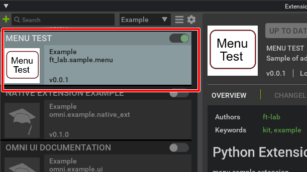
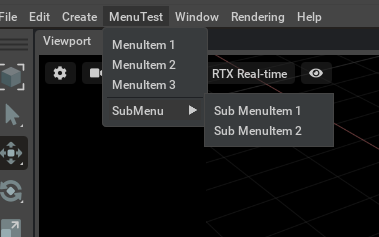

# ft_lab.sample.menu

"ft_lab.sample.menu" はメニューを追加する簡単なサンプルExtensionです。    

## Extensionの構成

"ft_lab.sample.menu" Extensionの構成です。     

```
[ft_lab.sample.menu]
    [config]
        extension.toml

    [data]
        icon.png      ... Icon file (256 x 256 pixel).
        preview.png

    [docs]
        CHANGELOG.md
        index.rst
        README.md

    [ft_lab]
        [sample]
            [menu]
                __init__.py
                main.py
```

## data/icon.png

アイコンファイル(256 x 256 pixel)。    
"config/extension.toml"から参照されます。    

## data/preview.png

ExtensionウィンドウのOVERVIEWで表示される画像です。      
"config/extension.toml"から参照されます。    

## docs

ドキュメント。     

|ファイル名|説明|     
|---|---|     
|index.rst|ドキュメントの構造を記載したファイル。|     
|README.md|OVERVIEWに表示される内容。|     
|CHANGELOG.md|CHANGELOGに表示される内容。|     

### index.rst

```
ft_lab.sample.menu
###########################

.. toctree::
   :maxdepth: 1

   README
   CHANGELOG
```
## config/extension.toml

"extension.toml"はExtentionの設定を記載します。     

```
[package]
version = "0.0.1"

authors = ["ft-lab"]

title = "Menu Test"
description="Sample of adding a Menu."

readme  = "docs/README.md"

repository = ""

category = "Example"

keywords = ["kit", "example"]

changelog="docs/CHANGELOG.md"

preview_image = "data/preview.png"

icon = "data/icon.png"

[dependencies]

[[python.module]]
name = "ft_lab.sample.menu"
```

## ft_lab.sample.menu

"ft_lab.sample.menu"内は、"ft_lab/sample/menu"の階層でフォルダを構成します。     
```
[ft_lab]
    [sample]
        [menu]
            __init__.py
            main.py
```

### __init__.py

開始するメインファイル (main.py)のインポートを指定します.     

```
from .main import *
```

### main.py

Extensionの開始時と終了時に呼び出すメソッドを指定します。     
```python
class MenuExtension(omni.ext.IExt):
    # Menu list.
    _menu_list = None
    _sub_menu_list = None

    # Menu name.
    _menu_name = "MenuTest"
    
    def on_startup(self, ext_id):
        print("[ft_lab.sample.menu] MenuExtension startup")

        # Initialize menu.
        self.init_menu()

    def on_shutdown(self):
        print("[ft_lab.sample.menu] MenuExtension shutdown")

        # Term menu.
        self.term_menu()
```

"on_startup"でExtensionを開始したときの処理を記載します。     
ここの「self.init_menu()」にてメニューを作成しています。      
"on_shutdown"でExtensionを終了したときの処理を記載します。     
ここの「self.term_menu()」にてメニューの破棄処理を行っています。     

メニューの初期化処理は以下のように記載。     
```python
    def init_menu (self):
        async def _rebuild_menus():
            await omni.kit.app.get_app().next_update_async()
            omni.kit.menu.utils.rebuild_menus()

        def menu_select (mode):
            if mode == 0:
                print("Select MenuItem 1.")
            if mode == 1:
                print("Select MenuItem 2.")
            if mode == 2:
                print("Select MenuItem 3.")
            if mode == 10:
                print("Select Sub MenuItem 1.")
            if mode == 11:
                print("Select Sub MenuItem 2.")

        self._sub_menu_list = [
            MenuItemDescription(name="Sub MenuItem 1", onclick_fn=lambda: menu_select(10)),
            MenuItemDescription(name="Sub MenuItem 2", onclick_fn=lambda: menu_select(11)),
        ]

        self._menu_list = [
            MenuItemDescription(name="MenuItem 1", onclick_fn=lambda: menu_select(0)),
            MenuItemDescription(name="MenuItem 2", onclick_fn=lambda: menu_select(1)),
            MenuItemDescription(name="MenuItem 3", onclick_fn=lambda: menu_select(2)),
            MenuItemDescription(),
            MenuItemDescription(name="SubMenu", sub_menu=self._sub_menu_list),
        ]

        # Rebuild with additional menu items.
        omni.kit.menu.utils.add_menu_items(self._menu_list, self._menu_name)
        asyncio.ensure_future(_rebuild_menus())
```
self._sub_menu_listにメニュー項目を格納しています。       
「MenuItemDescription(name="SubMenu", sub_menu=self._sub_menu_list)」でサブメニューを追加しています。     

```python
        omni.kit.menu.utils.add_menu_items(self._menu_list, self._menu_name)
        asyncio.ensure_future(_rebuild_menus())
```
で、メニュー項目を追加し、遅延でメニューを更新しています。      

メニュー項目が選択されたときに、選択されているメニュー項目名をprintしています。     

メニューの破棄処理は以下のように記載。     
```python
    def term_menu (self):
        async def _rebuild_menus():
            await omni.kit.app.get_app().next_update_async()
            omni.kit.menu.utils.rebuild_menus()

        # Remove and rebuild the added menu items.
        omni.kit.menu.utils.remove_menu_items(self._menu_list, self._menu_name)
        asyncio.ensure_future(_rebuild_menus())
```
「omni.kit.menu.utils.remove_menu_items」で追加したメニュー項目を削除。       
「asyncio.ensure_future(_rebuild_menus())」で遅延でメニューを更新しています。      

## Omniverse CreateにExtensionを入れる

Omniverse Createが"pkg/create-2021.3.8"にインストールされているとします。     
作成した"ft_lab.sample.menu"をフォルダごと"pkg/create-2021.3.8/exts"に格納します。      
Omniverse Createを起動したままでもExtensionを所定のフォルダに入れると、自動的にExtensionが認識されます。     

メインメニューの"Window"-"Extensions" を選択し、Extensionsウィンドウを表示します。     

Extensionのリストで"Python Extension Example"が存在するのを確認できました。     
    

これをOnにすると、"MenuTest"というメニュー項目が表示されます。      
    

Offにした場合"MenuTest"内は空になりますが、トップメニューの"MenuTest"は残ってしまうようです (Omniverse Create 2021.3.8で確認)。     
Omniverse Code 2022.1.0ではこの問題は起きなかったため、この現象は将来Kit側で修正されるものと思われます。     
