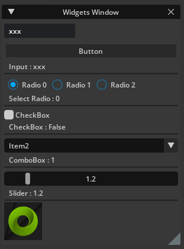
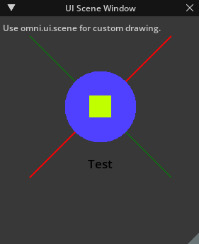
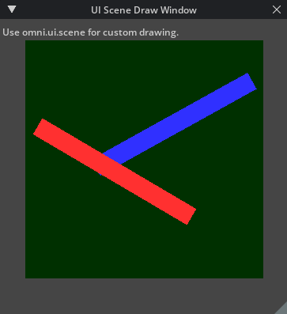
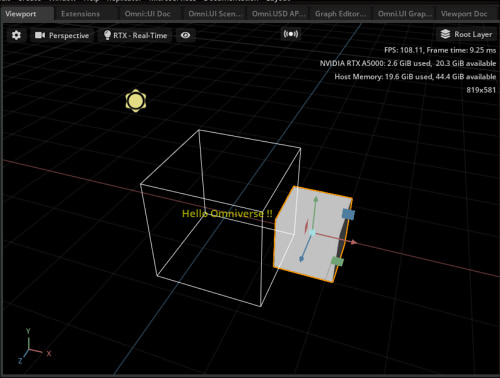

# Extension

簡単なサンプルのExtensionです。      
Extensionはモジュール的にOmniverse(Kit)を使ったアプリを拡張します。      
ExtensionはベースはPythonとして記載し、別途C言語(動的ライブラリとして関数呼び出し)で外部機能を実装することができます。      

## Extensionの詳しいドキュメント

Extensionは構成のルールがあります。      
Omniverse Createの[Help]-[Developers Manual]からOmniverse Kitのドキュメントの「Extensions」で詳しく解説されています。    

## Extension作成に関する情報

* [extension.tomlでの記述内容](./knowledge/config_info.md)

## サンプル

|Extension|説明|     
|---|---|     
|[ft_lab.sample.hello](./ft_lab.sample.hello)|開始(startup)/破棄(shutdown)のみの簡単なExtension|     
|[ft_lab.sample.callDLL](./ft_lab.sample.callDLL)|C言語のDLLより関数を読み込む|     
|[ft_lab.sample.menu](./ft_lab.sample.menu)|メニューを追加。 |     
|[ft_lab.sample.loadStage](./ft_lab.sample.loadStage)|Extension内に配置したusdファイルを新規Stageとして読み込む|     
|[ft_lab.sample.widgets](./ft_lab.sample.widgets)|omni.uiの使用例。 ウィンドウを表示し、ウィジットを配置。 |     
|[ft_lab.sample.uiScene](./ft_lab.sample.uiScene)|omni.ui.sceneの使用例。 ウィンドウを表示し、SceneViewに描画を行う。 |     
|[ft_lab.sample.uiSceneDraw](./ft_lab.sample.uiSceneDraw)|omni.ui.sceneの使用例。 ウィンドウを表示し、SceneViewに順番を考慮した描画を行う。 また、描画を更新し、SceneViewでアニメーションする。 |     
|[ft_lab.sample.uiSceneViewportOverlay](./ft_lab.sample.uiSceneViewportOverlay)|omni.ui.sceneの使用例。 ViewportにSceneViewをオーバレイ表示する。 |     
|[ft_lab.sample.uiSceneShowPrimName](./ft_lab.sample.uiSceneShowPrimName)|omni.ui.sceneの使用例。 ViewportにSceneViewをオーバレイ表示する。 選択Prim名を形状のローカル座標の中心に表示。 |     

