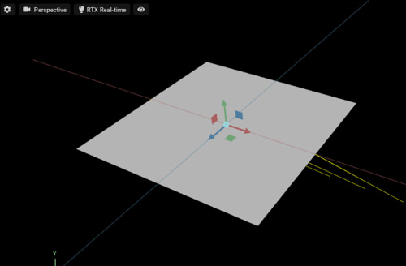
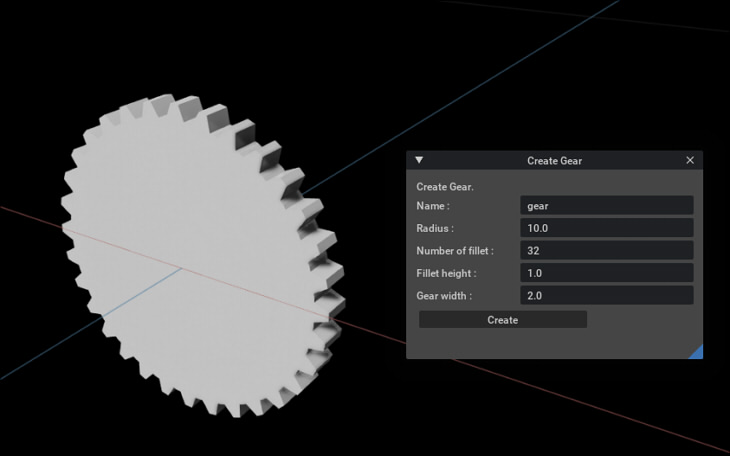

# CreateMesh

Meshを生成/Mesh情報を取得します。    

|ファイル|説明|     
|---|---|     
|[CreateSimpleMesh.py](./CreateSimpleMesh.py)|簡単な1枚板のMeshを作成 |     
|[CreateGear.py](./CreateGear.py)|歯車のMeshを作成 |     
|[GetMeshInfo.py](./GetMeshInfo.py)|選択形状がMeshの場合のMesh情報を取得|     

