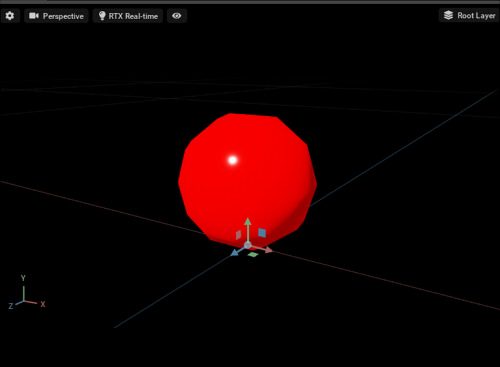
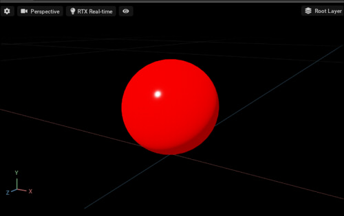

# CreateSphere

球を作成します。    

## [CreateSphere.py](./CreateSphere.py)    

簡単な球を作成します。     
    

## [CreateSphereWithRefinement.py](./CReateSphereWithRefinement.py)    

作成する球の分割数を増やします。    
属性"Refinement"を指定しています。    

    

## [GetSphereInfo.py](./GetSphereInfo.py)    

球の情報を取得します。     

