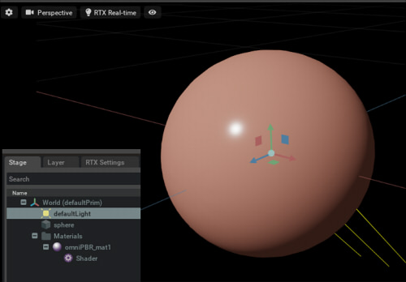
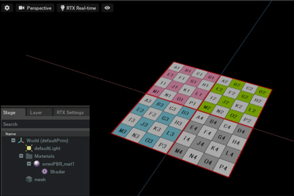
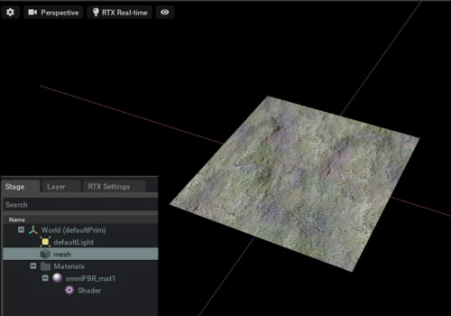

# OmniPBR

## Overview

Create a material for OmniPBR.    

## [CreateMaterial.py](./CreateMaterial.py)    

Create a simple omniPBR material.     
Assign a material to the sphere.    
    

## [CreateMaterialWithDiffuseTexture.py](./CreateMaterialWithDiffuseTexture.py)    

Create a material by specifying the diffuseColor texture.      
Assign a material to the mesh.    
    

## [CreateMaterialWithDiffuseNormalTexture.py](./CreateMaterialWithDiffuseNormalTexture.py)    

Create a material by specifying the diffuseColor texture/normal texture.      
Assign a material to the mesh.    
    

