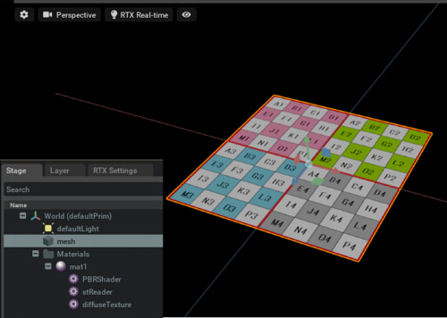
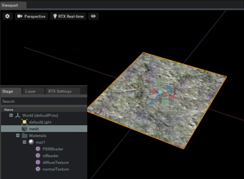

# UsdPreviewSurface

UsdPreviewSurfaceのマテリアルを割り当て。    

## [CreateMaterial.py](./CreateMaterial.py)    

球にシンプルなマテリアルを割り当て。     
    

## [CreateMaterialWithDiffuseTexture.py](./CreateMaterialWithDiffuseTexture.py)    

MeshにdiffuseColorテクスチャを割り当てる。      
    

## [CreateMaterialWithDiffuseNormalTexture.py](./CreateMaterialWithDiffuseNormalTexture.py)    

MeshにdiffuseColorテクスチャ/法線マップテクスチャを割り当てる。      
    
