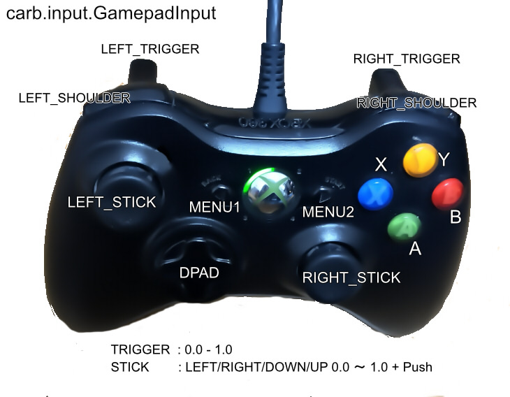

# GamePad

GamePadでの操作を取得します。      
XBOX Controllerの場合は以下のような入力になります。     
    

|入力|値|
|---|---|
|carb.input.GamepadInput.LEFT_SHOULDER|0 or 1|
|carb.input.GamepadInput.RIGHT_SHOULDER|0 or 1|
|carb.input.GamepadInput.LEFT_TRIGGER|0 - 1|
|carb.input.GamepadInput.RIGHT_TRIGGER|0 - 1|
|carb.input.GamepadInput.DPAD_DOWN carb.input.GamepadInput.DPAD_UP carb.input.GamepadInput.DPAD_LEFT carb.input.GamepadInput.DPAD_RIGHT|0 or 1|
|carb.input.GamepadInput.X|0 or 1|
|carb.input.GamepadInput.Y|0 or 1|
|carb.input.GamepadInput.A|0 or 1|
|carb.input.GamepadInput.B|0 or 1|
|carb.input.GamepadInput.MENU1|0 or 1|
|carb.input.GamepadInput.MENU2|0 or 1|
|carb.input.GamepadInput.LEFT_STICK_DOWN carb.input.GamepadInput.LEFT_STICK_UP carb.input.GamepadInput.LEFT_STICK_LEFT carb.input.GamepadInput.LEFT_STICK_RIGHT|0 - 1|
|carb.input.GamepadInput.RIGHT_STICK_DOWN carb.input.GamepadInput.RIGHT_STICK_UP carb.input.GamepadInput.RIGHT_STICK_LEFT carb.input.GamepadInput.RIGHT_STICK_RIGHT|0 - 1|
|carb.input.GamepadInput.LEFT_STICK |0 or 1|
|carb.input.GamepadInput.RIGHT_STICK |0 or 1|

## サンプル

|ファイル|説明|     
|---|---|     
|[GamePad.py](./GamePad.py)|GamePad情報を取得（特定のボタンのみ）|     
|[GamePad_moveSelectPrim.py](./GamePad_moveSelectPrim.py)|GamePadのLeftStick操作で選択形状を移動|     
