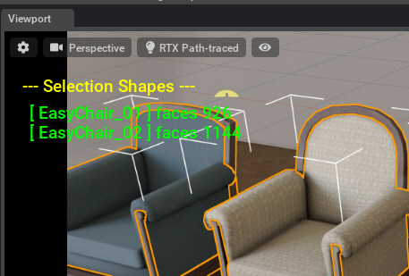

# Selection

StageウィンドウでのPrimの選択を取得。      

|ファイル|説明|     
|---|---|     
|[GetSelection.py](./GetSelection.py)|Primの選択を取得|     
|[IsSelected.py](./IsSelected.py)|指定されたパスのPrimが選択されているかどうか|     
|[Select.py](./Select.py)|指定されたパスのPrimを選択|     
|[EventSelection.py](./EventSelection.py)|選択変更イベントを取得し、選択されたPrim名を表示|     
|[EventSelection_showFacesCount.py](./EventSelection_showFacesCount.py)|選択されたPrim名、子要素も含めたMeshの面数をビューポートに表示 

