# PLATEAU

Project PLATEAU ( https://www.mlit.go.jp/plateau/ )の都市データをOmniverseにインポートします。      

G空間情報センターの「3D都市モデルポータルサイト」( https://www.geospatial.jp/ckan/dataset/plateau )の「東京都23区」より、     
OBJ形式のデータを使用しています。      

また、地形のテクスチャについてはGeoTIFFを分割して使用しました。     

2022/06/26 : objからusdに変換して読み込むようにしました。     

## 使い方

### 「東京都23区」のobjファイル一式をダウンロード

「3D都市モデルポータルサイト」より、「東京都23区」のobjファイル一式をダウンロードします。     
https://www.geospatial.jp/ckan/dataset/plateau-tokyo23ku/resource/9c8d65f1-a424-4189-92c0-d9e3f7c3d2db

「13100_tokyo23-ku_2020_obj_3_op.zip」がダウンロードされますので解凍します。      

注意 : 配置パスに日本語名のフォルダがある場合は正しく動作しません。     


### 「東京都23区」のGeoTIFFファイル一式をダウンロード

また、地形のテクスチャで「東京都23区」の「GeoTIFF」のオルソ画像データを用います。     
これは航空写真を平行投影として地域メッシュの2次メッシュ(533926、533935など)ごとにテクスチャ化したものです。     
以下より、GeoTIFFの画像をダウンロードします。      
https://www.geospatial.jp/ckan/dataset/plateau-tokyo23ku/resource/2434d5b4-7dad-4286-8da5-276f68a23797

「13100_tokyo23-ku_2020_ortho_2_op.zip」がダウンロードされますので解凍します。      

### GeoTIFF画像を10x10分割してjpeg形式に変換

Omniverseでは、tiff画像を扱うことができません。     
そのためjpegに変換するようにしました。      
また、8K解像度以上のテクスチャは読み込みに失敗するようです。     
そのため、このtiffを10x10分割しそれぞれをjpegに変換します。      

この処理はOmniverse上で行うことにしました。      
Omniverse Createを起動します。       
Omniverse Create 2022.1.2で確認しました。    

[divide_GeoTiff_images.py](./divide_GeoTiff_images.py) のスクリプトの内容を、OmniverseのScript Editorにコピーします。     

「in_plateau_obj_path」のパスに、「13100_tokyo23-ku_2020_ortho_2_op.zip」を解凍して展開されたフォルダのルートを指定します。      
「in_save_folder_path」にそれぞれのtiff画像を10x10分割したときの画像を格納するフォルダを指定します。      

スクリプトを実行します。     
この処理は時間がかかります。Consoleに"Save success !!"と出ると出力完了です。     
「in_save_folder_path」に指定したフォルダに53392500.jpg/53392501.jpgなどが出力されていることを確認します。      
このTiffからjpeg出力を行う処理は1回だけ行えばOKです。       

注意 : 配置パスに日本語名のフォルダがある場合は正しく動作しません。     


### 例1 : 東京23区の地形と建物(LOD1)を読み込み

※ テクスチャは反映しません。     

 
Omniverse Createを起動し、新規Stageを作成します。     

「[import_PLATEAU_tokyo23ku_obj.py](./import_PLATEAU_tokyo23ku_obj.py)」の内容をScript Editorにコピーします。     

スクリプト上の 「in_plateau_obj_path」のパス指定を、ローカルの「13100_tokyo23-ku_2020_obj_3_op.zip」を解凍したフォルダに変更します。      

スクリプト上の 「in_assign_dem_texture」をFalseにします。     
これにより、demにマッピングするテクスチャは読み込まれません。     

スクリプトを実行します。     
この処理は時間がかかります。数分ほど待つと、StageにPLATEAUの都市データが読み込まれます。     

以下は背景のEnvironmentを指定し、RTX-Interactive (Path Tracing)にしています。     
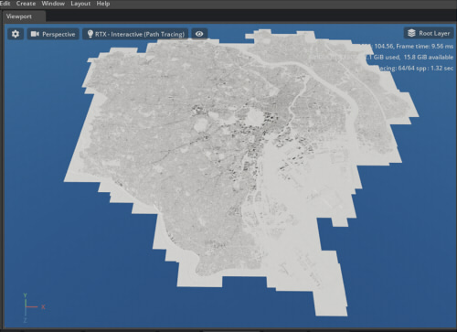     
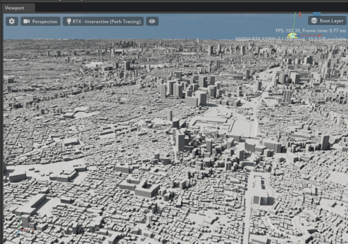    

このLOD1のみの都市データは、Omniverse Createで約12GBくらいのメモリを消費します。      
OSのメモリは32GBあれば足ります。     

2022/06/26    
すべてのデータをobjからusdに変換して読み込むようにしました。    
変換されたusdは、in_plateau_obj_pathの"output_usd"フォルダに格納されます。     

### 例2 : 東京23区の地形と建物(LOD1)を読み込み + 地形のテクスチャを反映

Omniverse Create 2022.1.2で確認しました。    
Omniverse Createで新規Stageを作成します。     

「[import_PLATEAU_tokyo23ku_obj.py](./import_PLATEAU_tokyo23ku_obj.py)」の内容をScript Editorにコピーします。     

スクリプト上の 「in_plateau_obj_path」のパス指定を、ローカルの「13100_tokyo23-ku_2020_obj_3_op.zip」を解凍したフォルダに変更します。      
スクリプト上の 「in_dem_textures_path」のパスは、ローカルのGeoTiffからjpeg変換したときの出力先を指定します。     

スクリプト上の 「in_assign_dem_texture」がTrueになっているのを確認します。     
これにより、「in_dem_textures_path」で指定したフォルダからテクスチャが読み込まれ、マテリアルとテクスチャが地形のMeshであるdemに割り当てられます。     

スクリプトを実行します。     
この処理は時間がかかります。数分ほど待つと、StageにPLATEAUの都市データが読み込まれます。     
地形にはテクスチャが割り当てられています。       

以下は背景のEnvironmentを指定し、RTX-Interactive (Path Tracing)にしています。     
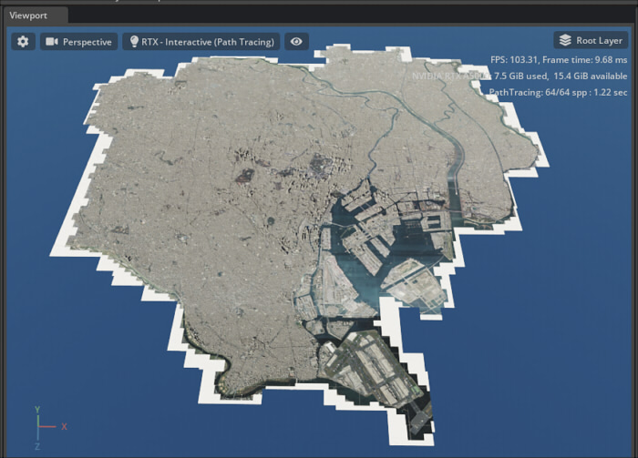     
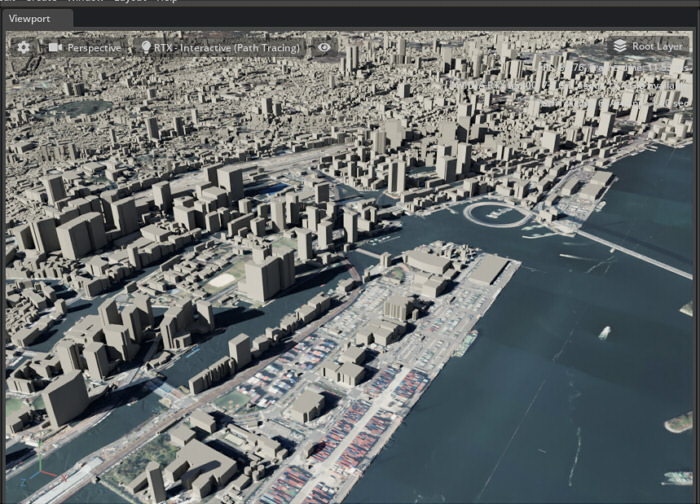    

このLOD1のみの都市データは、Omniverse Createで約13GBくらいのメモリを消費します。      
OSのメモリは32GBあれば足ります。     

### 例3 : 東京23区の地形と建物(LOD1またはLOD2)を読み込み + 地形のテクスチャを反映

LOD2の建物がある場合はそれを読み込みます。      

Omniverse Create 2022.1.2で確認しました。    
Omniverse Createで新規Stageを作成します。     

「[import_PLATEAU_tokyo23ku_obj.py](./import_PLATEAU_tokyo23ku_obj.py)」の内容をScript Editorにコピーします。     

スクリプト上の 「in_plateau_obj_path」のパス指定を、ローカルの「13100_tokyo23-ku_2020_obj_3_op.zip」を解凍したフォルダに変更します。      
スクリプト上の 「in_dem_textures_path」のパスは、ローカルのGeoTiffからjpeg変換したときの出力先を指定します。     

スクリプト上の 「in_assign_dem_texture」がTrueになっているのを確認します。     
これにより、「in_dem_textures_path」で指定したフォルダからテクスチャが読み込まれ、マテリアルとテクスチャが地形のMeshであるdemに割り当てられます。     

スクリプト上の「in_load_lod2」をTrueに変更します。     
これにより、もし建物にLOD2の情報を持つ場合はそれが読み込まれます。     
※ LOD2はテクスチャを伴います。これにより、読み込み速度とメモリはかなり消費します。     

また、スクリプト上の「mapIndexList」に地域メッシュの2次メッシュの番号を配列で入れています。      
デフォルトでは東京23区全体をいれていますが、メモリに合わせて2次メッシュの番号を調整します。     
ここでは以下のように変更しました。      
```
mapIndexList = [533945, 533946]
```

スクリプトを実行します。     
LOD2を読み込む場合は時間がかなりかかります。     
20分ほどで読み込みが完了しました。     
「mapIndexList = [533945, 533946]」でOmniverse Createで約11GBくらいのメモリを消費。      

続いて    
```
mapIndexList = [533935, 533936]
```
として追加でスクリプトを実行し、地形データを読み込みました。      
30分ほどで読み込みが完了しました。     
追加の「mapIndexList = [533935, 533936]」でOmniverse Createで合計約20GBくらいのメモリを消費。      

スクリプトで連続して複数の2次メッシュ分を読み込む場合、読み込み完了後にフリーズする場合がありました（マテリアルの更新でぶつかる？）。     
Omniverse CreateのステータスバーでLoading Materialと出てプログレスバーのパーセントが進まない場合がありました。        
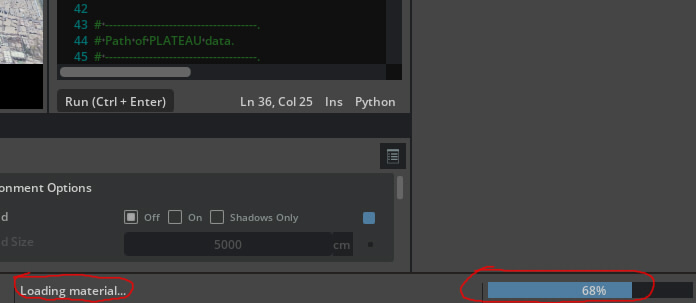    
これを回避するため、読み込みが完全に完了するのを待って何回かに分けてスクリプトを複数回実行するようにしています。      


以下は背景のEnvironmentを指定し、RTX-Interactive (Path Tracing)にしています。     
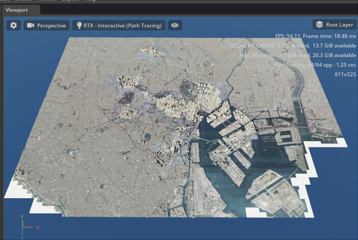    
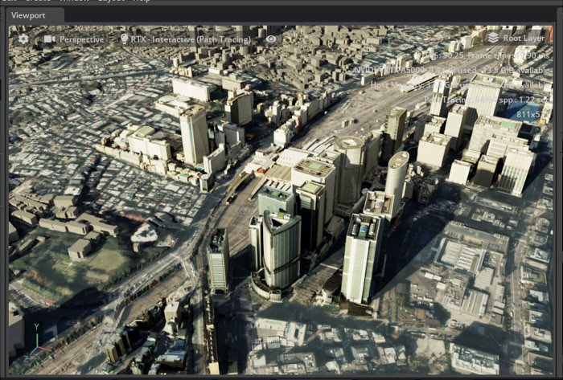    


LOD2も考慮した[533945, 533946, 533935, 533936]の2次メッシュ範囲のデータは、Omniverse Createで合計で約20GBくらいのメモリを消費します。      
OSのメモリは32GBでは読み込めませんでした。64GBくらい余裕を持たせたほうがよさそうです。     

### 例4 : 東京23区の地形と建物(LOD1またはLOD2)、橋(LOD2)を読み込み + 地形のテクスチャを反映

LOD2の建物がある場合はそれを読み込みます。      
また、LOD2の橋も読み込みます。     

Omniverse Create 2022.1.2で確認しました。    
Omniverse Createで新規Stageを作成します。     

「[import_PLATEAU_tokyo23ku_obj.py](./import_PLATEAU_tokyo23ku_obj.py)」の内容をScript Editorにコピーします。     

スクリプト上の 「in_plateau_obj_path」のパス指定を、ローカルの「13100_tokyo23-ku_2020_obj_3_op.zip」を解凍したフォルダに変更します。      
スクリプト上の 「in_dem_textures_path」のパスは、ローカルのGeoTiffからjpeg変換したときの出力先を指定します。     

スクリプト上の 「in_assign_dem_texture」がTrueになっているのを確認します。     
これにより、「in_dem_textures_path」で指定したフォルダからテクスチャが読み込まれ、マテリアルとテクスチャが地形のMeshであるdemに割り当てられます。     

スクリプト上の「in_load_lod2」をTrueに変更します。     
これにより、もし建物にLOD2の情報を持つ場合はそれが読み込まれます。     
※ LOD2はテクスチャを伴います。これにより、読み込み速度とメモリはかなり消費します。     

スクリプト上の「in_load_bridge」をTrueに変更します。     
これにより、LOD2の橋の3Dモデルも読み込まれます。      

また、スクリプト上の「mapIndexList」に2次メッシュの番号を配列で入れています。      
デフォルトでは東京23区全体をいれていますが、メモリに合わせて2次メッシュの番号を調整します。     
ここでは以下のように変更しました。      
```
mapIndexList = [533935]
```

スクリプトを実行します。     

以下は背景のEnvironmentを指定し、RTX-Interactive (Path Tracing)にしています。     
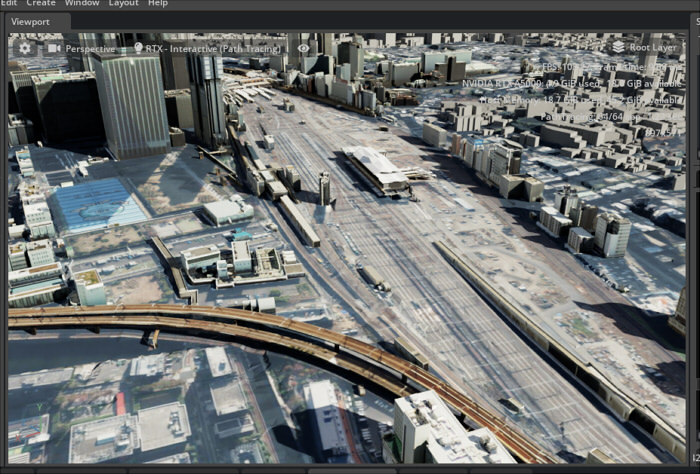    

LOD2で橋を追加するとさらにメモリ消費は増加することになります。      
ですが、建物に比べて橋は数が少ないです。     

## スクリプトを使った緯度経度の確認

いくつか緯度経度計算を行う際の確認用スクリプトを作成しました。     

### 緯度経度を指定し、平面直角座標/Omniverse上のXZ位置に変換

地理院地図の「平面直角座標への換算」( https://vldb.gsi.go.jp/sokuchi/surveycalc/surveycalc/bl2xyf.html )をPythonスクリプトに置き換えました。

[calcLatLongToOmniverse.py](./calcLatLongToOmniverse.py)     
これはスクリプトのみの計算になります。      
スクリプトの(in_lat, in_longi)に緯度経度を指定すると平面直角座標での位置を計算、Omniverse(USD)の座標系（Y-Up/右手系/cm単位）に変換します。     
Omniverse上の-Z方向が北向きとします。      

以下は地理院地図( https://maps.gsi.go.jp/ )での東京タワー前。    
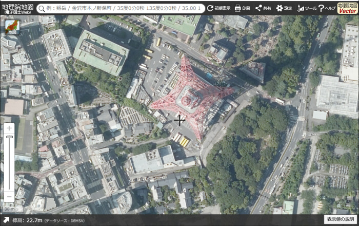    
緯度 : 35.658310      
経度 : 139.745243      

これをこのスクリプトで計算すると、Omniverse上のXZ位置は以下のように計算できました。      
x = -797587.3075871967 (cm)      
z = 3790513.4729016027 (cm)      

この位置に赤いマテリアルを与えたSphereを配置すると以下のようになりました。     
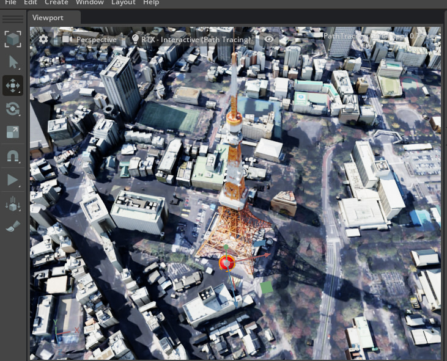    


### 2点間の距離を計算（単純な直線距離）

[calcDistance.py](./calcDistance.py)    
選択された2つの形状の中心位置の距離を単純計算します。     
cmとm単位の距離をConsoleに出力します。     
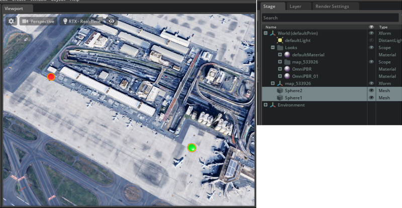    

### 2つの緯度経度を指定して距離を計算

地理院地図の「距離と方位角の計算」( https://vldb.gsi.go.jp/sokuchi/surveycalc/surveycalc/bl2stf.html )をPythonスクリプトに置き換えました。     

[calcDistanceWithLatLong.py](./calcDistanceWithLatLong.py)      
これはスクリプトのみの計算になります。      
スクリプトの(in_lat1, in_longi1)に開始位置の緯度経度を指定、(in_lat2, in_longi2)に終了位置の緯度経度を指定します。     
この2つの緯度経度の距離をmとkm単位でConsoleに出力します。     

## USDファイル変換について

「[import_PLATEAU_tokyo23ku_obj.py](./import_PLATEAU_tokyo23ku_obj.py)」を実行する際、PLATEAUのobjファイルをusdファイルに変換します。     
変換されたUSDファイルは「in_plateau_obj_path + "/output_usd"」に格納されます。     
東京23区全体でusdと関連テクスチャファイルは全体で4GBほどのファイル容量になりました。      
また、objからusdに変換する処理は時間がかかります。      

2回目以降、すでにusdファイルが存在する場合はこのusdファイル変換処理はスキップされます。     
もし、改めてobjからusd変換する場合は「in_plateau_obj_path + "/output_usd"」ファイルを削除するようにしてください。        

Omniverseではobj/fbxファイルを直接Referenceできますが、できるだけusdに変換して扱うほうがよいと思われます。    

## Collect Asset : Nucleusにアップロードするには？

参考 : https://docs.omniverse.nvidia.com/app_create/prod_extensions/ext_collect.html

「Collect Asset」を使用することで、
対象usdファイル内からusdファイルや画像ファイルなどの参照がある場合に相対パスになるように整理して出力します。     
これによりローカルの環境依存がある状態でのパスが整理され、Nucleusへのアップロードができるようになります。     

「[import_PLATEAU_tokyo23ku_obj.py](./import_PLATEAU_tokyo23ku_obj.py)」を使用して東京23区の都市データを読み込み後、       
現在のStageをusdファイルに保存します。     
なお、このとき参照されるファイルもすべてUSDファイルで構成されるようにしておいてください。デフォルトの「in_convert_to_usd = True」の指定でobjはUSDに変換されます。      

Contentウィンドウで保存したusdを右クリックしてポップアップメニューを表示。       
「Collect Asset」を選択します。     
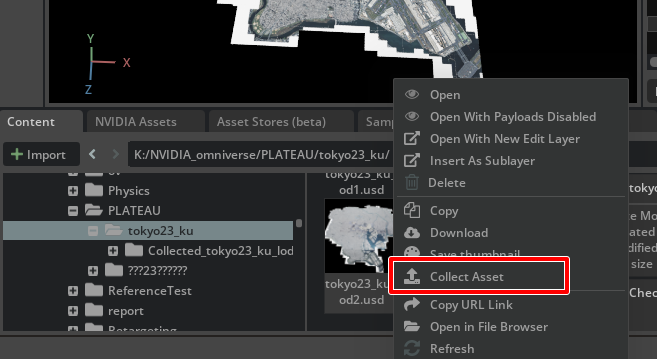    
Collection Optionsウィンドウで「Collection Path」に出力先を指定します。     
ここでNucleus上のパスを指定しました。      
Collectボタンを押すと、指定のパスに整理した状態でusdや参照されているテクスチャなどを出力します。      
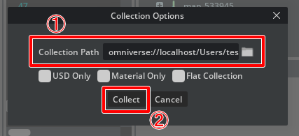    

### Collect Asset使用時の注意点

Omniverse Create 2022.1.3段階で、以下の点を確認しています。

* 対象のUSDファイルから参照(Reference)するAssetは、usdファイルを指定するようにしてください。       
objやfbxを直接参照することもできますが、この場合はCollect Assetでマテリアルファイルやテクスチャファイルが正しく渡せませんでした。     
* Material Graphを使用すると、Collect AssetでMDLファイルが正しく渡せませんでした。     

----

## ファイル

|ファイル|説明|     
|---|---|     
|[divide_GeoTiff_images.py](./divide_GeoTiff_images.py)|東京23区のPLATEAUのGeoTIFFファイルを10x10分割して、jpeg形式で指定のフォルダに出力します。<br>コード内の「in_xxx」の指定を環境に合わせて書き換えるようにしてください。|
|[import_PLATEAU_tokyo23ku_obj.py](./import_PLATEAU_tokyo23ku_obj.py)|東京23区のPLATEAUのobjファイルより、都市モデルをOmniverseにインポートします。<br>コード内の「in_xxx」の指定を環境に合わせて書き換えるようにしてください。|
|[calcDistance.py](./calcDistance.py)|選択された2つの形状の直線距離を計算します。|
|[calcDistanceWithLatLong.py](./calcDistanceWithLatLong.py)|2つの緯度経度を指定して距離を計算します。<br>コード内の「in_xxx」の指定を環境に合わせて書き換えるようにしてください。|
|[calcLatLongToOmniverse.py](./calcLatLongToOmniverse.py)|緯度経度から平面直角座標上の位置を計算、Omniverse上のXZ位置を計算します。<br>コード内の「in_xxx」の指定を環境に合わせて書き換えるようにしてください。|

## 現状の既知問題点

Omniverse Create 2022.1.3で確認。     

### 大量のusdをReferenceする際にプログレスバーが止まる

※ 開発にレポート済み。      

「[import_PLATEAU_tokyo23ku_obj.py](./import_PLATEAU_tokyo23ku_obj.py)」を使って都市データを読み込む場合、
Omniverse CreateのステータスバーでLoading Materialと出てプログレスバーのパーセントが進まない場合がありました。        
    
これを回避するため、読み込みが完全に完了するのを待って何回かに分けてスクリプトを複数回実行するようにします。      
LOD1だけの読み込みの場合は、地域メッシュ全部(14個分)を読み込む場合でも停止することはありませんでした。      
LOD2を含む場合、マップを1つまたは2つずつ読み込まないとフリーズします。     

### 作成されたusdファイルを保存する際にSaving layersで進まない

※ 開発にレポート済み。      

東京23区全体を読み込んで保存する場合、Saving layersでずっと進まない場合がありました。     
数時間待てば処理が完了します。     
回避策として、マップを1つだけ読み込んでその段階でいったん保存。    
マップを追加読み込んで保存、とすると時間がかからないようでした。     

### 保存したusdファイルを読み込む場合にプログレスバーが止まる

※ 開発にレポート済み。      

東京23区全体(LOD2)を読み込んで保存後、いったんOmniverse Createを再起動してusdを読み込みます。     
この際、Loading Materialと出てプログレスバーのパーセントが進まない場合がありました。    
おそらく１つめの「大量のusdをReferenceする際にプログレスバーが止まる」と同じ現象と思われます。      

### objファイルをReferenceした状態で保存すると、再読み込み時にテクスチャが消える

「[import_PLATEAU_tokyo23ku_obj.py](./import_PLATEAU_tokyo23ku_obj.py)」を使って都市データを読み込む場合に「in_convert_to_usd」をFalseにすると、      
PLATEAUのobjを直接Referenceで参照します。      
「in_convert_to_usd」をTrueにするとobjからusdに変換してそれを参照します。      

東京23区全体(LOD2)を読み込んで保存後usdを閉じ、
再度同じシーンを開いた場合、テクスチャが消えてしまう場合があります。      
これはobjで読み込んだ場合のキャッシュ（objの場合、作業ディレクトリにusd変換した際のジオメトリやテクスチャが格納される）によるものと思われます。    

また、「Collect Asset」( https://docs.omniverse.nvidia.com/app_create/prod_extensions/ext_collect.html )を行ってNucleusにusd一式をアップロードする場合、    
objを使っているとマテリアルのmtlやテクスチャを渡してくれないようでした。     

そのため、OmniverseではStageはすべてusdを使用するほうがよさそうです。      

## 更新履歴

### 2022/06/26

* [import_PLATEAU_tokyo23ku_obj.py](./import_PLATEAU_tokyo23ku_obj.py)でUSDに変換してインポートするようにした

### 2022/06/10

* 初回バージョン