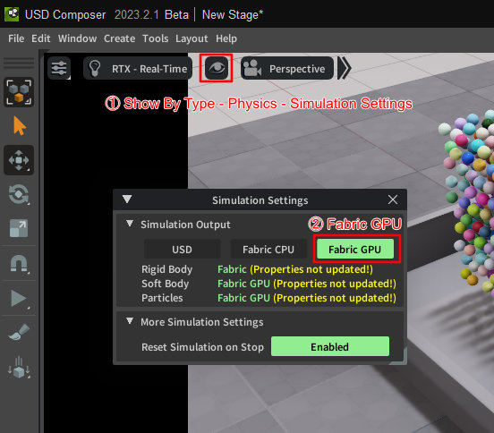
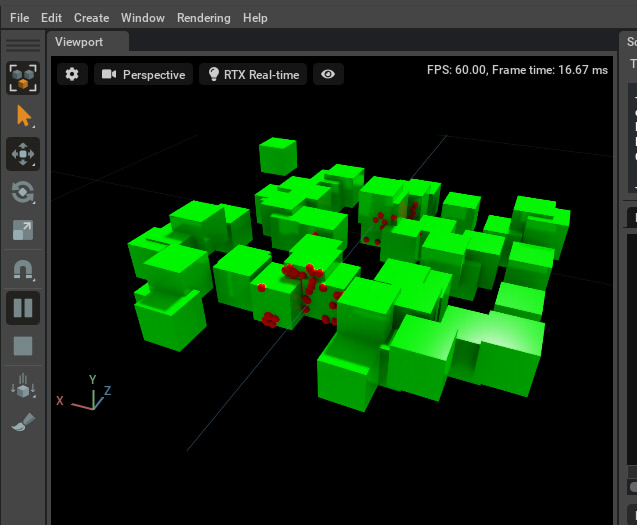

# Physics

Physicsのサンプルです。     
Physicsの計算はGPU上で行われます。    

PhysicsはUSDのUsdPhysics ( https://graphics.pixar.com/usd/release/api/usd_physics_page_front.html ) が使用されます。     

## Physicsデモ

Physicsのデモは、Omniverse Createのメインメニューの「Window」-「Physics」-「Demo Scenes」から確認でき、Extensionとしてのソースはすべて公開されているため参考になります。     
また、メインメニューの「Help」-「Physics Scripting Manual」から表示されるドキュメントに、
Physicsを使用する場合の説明がされています。     
これらの情報はかなり詳しく書かれており分かりやすいですので、PhysicsについてはOmniverse Create上のPhysicsデモから学習するほうが理解が深まると思います。      

## Physicsのアニメーションが遅い場合

デフォルトでは、Physicsの剛体を配置してアニメーション再生すると重いです。      
これは、アニメーション時にフレームごとにUSDを更新する書き込みが走るのが原因になります。     
USD Composer 2023.2.1の場合は、Viewportの設定から Show By Type - Physics - Simulation Settings を選択。      
Simulation Settingsウィンドウで"Fabric GPU"を選択します。     
      

## サンプル

|ファイル|説明|     
|---|---|     
|[RayCast.py](./RayCast.py)|Collisionの形状を配置し、レイの始点と向きを指定して衝突判定します。 このRayCastはアニメーション再生中に機能します。 |

|サンプル|説明|     
|---|---|     
|[simpleJoint01.py](./Joint/simpleJoint01.py)|2つのCubeをつなぐ簡単なジョイント |     
|[simpleJoint02.py](./Joint/simpleJoint02.py)|3つのCubeをつなぐ簡単なジョイント |     
|[rigidBody_01.py](./RigidBody/rigidBody_01.py)|RigidBodyによる簡単な自由落下 |     
|[rigidbody_benchmark.py](./RigidBody/rigidbody_benchmark.py)|RigidBodyによる球の自由落下。 たくさんの球を配置。 |     
|[gear_01.py](./Gear/gear_01.py)|歯車の回転。 アニメーション再生中に、歯車を回転させると連動します。 |     

