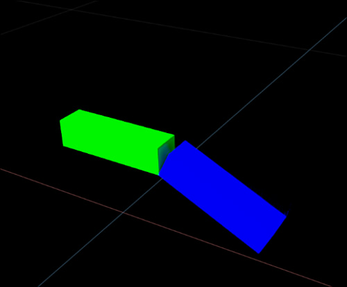
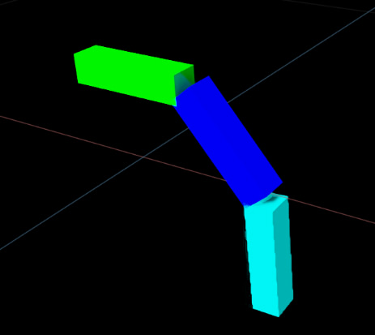
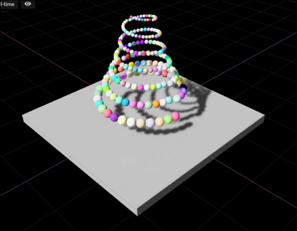
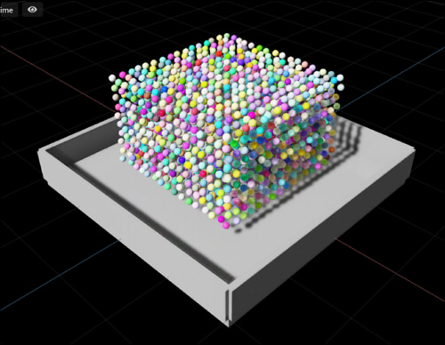

# Physics

Physicsのサンプルです。     
Physicsの計算はGPU上で行われます。    

## Physicsデモ

Physicsのデモは、Omniverse Createのメインメニューの「Window」-「Physics」-「Demo Scenes」から確認でき、Extensionとしてのソースはすべて公開されているため参考になります。     
また、メインメニューの「Help」-「Physics Scripting Manual」から表示されるドキュメントに、
Physicsを使用する場合の説明がされています。     
これらの情報はかなり詳しく書かれており分かりやすいですので、PhysicsについてはOmniverse Create上のPhysicsデモから学習するほうが理解が深まると思います。      

## Physicsのアニメーションが遅い場合

デフォルトでは、Physicsの剛体を配置してアニメーション再生すると重いです。      
これは、アニメーション時にフレームごとにUSDを更新する書き込みが走るのが原因になります。     
Extensionの「omni.physx.flatcache」をExtensionsウィンドウで検索し有効にすることで、この速度低下は解決します。      

## サンプル

|サンプル|説明|     
|---|---|     
|[simpleJoint01.py](./Joint/simpleJoint01.py)|2つのCubeをつなぐ簡単なジョイント |     
|[simpleJoint02.py](./Joint/simpleJoint02.py)|3つのCubeをつなぐ簡単なジョイント |     
|[rigidBody_01.py](./RigidBody/rigidBody_01.py)|RigidBodyによる簡単な自由落下 |     
|[rigidBody_benchmark.py](./RigidBody/rigidBody_benchmark.py)|RigidBodyによる球の自由落下。 たくさんの球を配置。 |     

