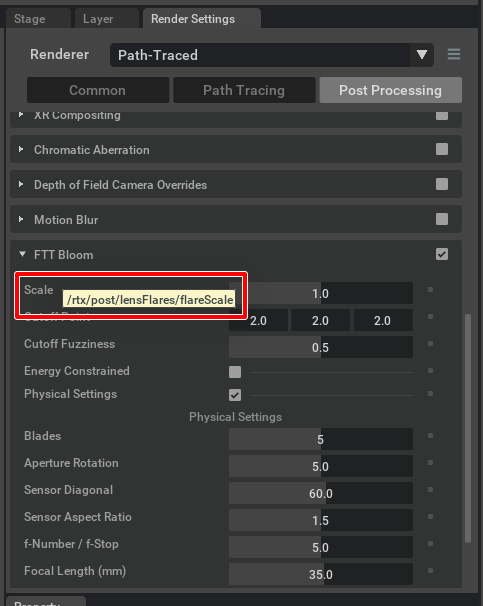

# Post Processing

Post Processingの変更を行います。      

Post ProcessingはOmniverse Createの「Post Processings」ウィンドウでパラメータにマウスを合わせたときのツールチップにパスが表示されています。      

下記の場合は"rtx/post/lensFlares/flareScale"。      
     

もしくはPost Processingの値を変更してusda形式でエクスポートすると、     
customLayerDataで以下のように"rtx:post: ... " というパスを確認できます。     
```
    dictionary renderSettings = {
        bool "rtx:post:lensFlares:enabled" = 1
        double "rtx:post:lensFlares:flareScale" = 0.2
        double "rtx:post:tonemap:fNumber" = 4.669999895617366
        token "rtx:rendermode" = "PathTracing"
    }
```

Pythonで以下のようにするとその値を変更できます。     

```python
import omni.kit

omni.kit.commands.execute("ChangeSetting", path="rtx/post/lensFlares/enabled", value=True)
omni.kit.commands.execute("ChangeSetting", path="rtx/post/lensFlares/flareScale", value=0.2)
```
「enabled」がPost Processingのその項目自身を有効/無効にする設定です。     

## サンプル

|ファイル|説明|     
|---|---|     
|[ChangePostProcessing.py](./ChangePostProcessing.py)|Post Processingの"FFT Bloom"のパラメータを変更します。|