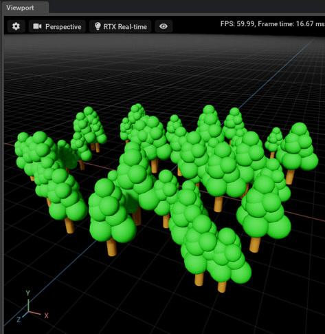

# Kind

指定のアセット(USDファイルで指定)をPointInstancerを使って、位置/回転/スケールを指定して複製。    

|ファイル|説明|    
|---|---|    
|[PointInstancer_01.py](./PointInstancer_01.py)|木の"simpleTree.usda"をアセットとして、ランダムな位置/スケールで複製。 |    

