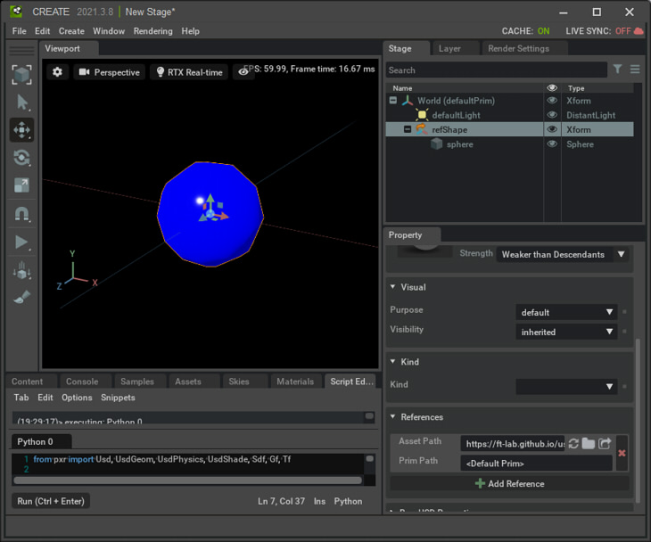
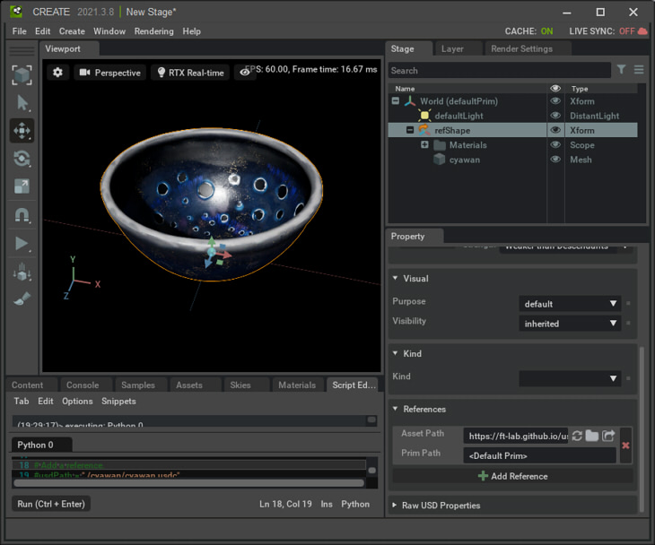
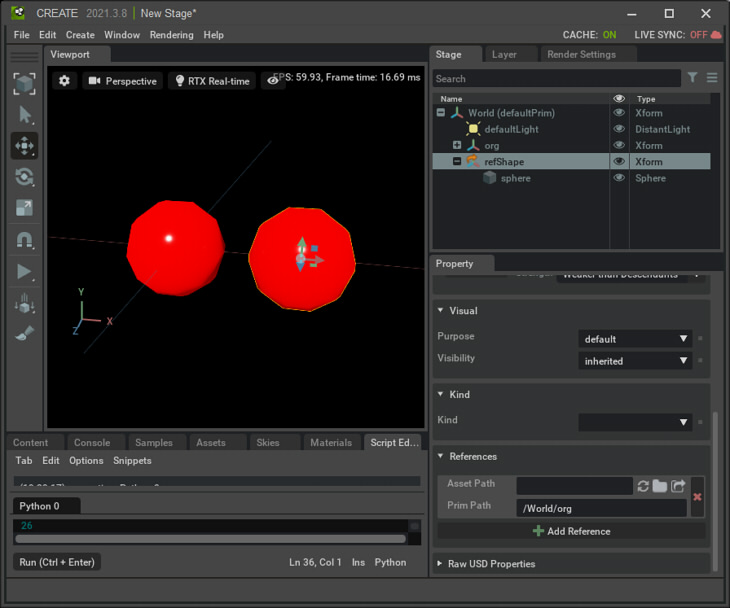

# Reference

参照の処理を行います。     

|ファイル|説明|    
|---|---|    
|[ReferenceTest.py](./ReferenceTest.py)|作成したXformに対して外部のusdファイルを参照として追加。 このサンプルでは、"ft-lab.github.io/usd/omniverse" 内を参照しています。 適宜「[sphere.usda](./usd/sphere.usda)」を相対パスとして検索できる位置に配置して試すようにしてください。 |    
|[ReferenceTest2.py](./ReferenceTest2.py)|作成したXformに対して外部のテクスチャ付きのusdファイルを参照として追加。 このサンプルでは、"ft-lab.github.io/usd/omniverse" 内を参照しています。 適宜「[./cyawan/cyawan.usdc](./usd/cyawan/cyawan.usdc)」を相対パスとして検索できる位置に配置して試すようにしてください。 |    
|[InternalReferenceTest.py](./InternalReferenceTest.py)|作成したXformに対して同一Stage内のPrimを参照として追加 |    
|[HasReference.py](./HasReference.py)|選択した形状が参照を持つかチェック|
