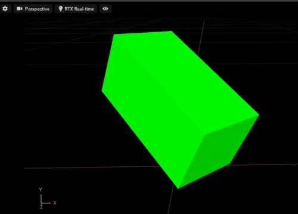

# Transform

## Overview

Get/Set transform(scale/rotate/translate).    

## [GetTransform.py](./GetTransform.py)    

Gets the Transform element of the selected shape and prints it.     

## [SetTransform.py](./SetTransform.py)    

Create a cube and set the transformation.     
    

## [GetWorldTransform.py](./GetWorldTransform.py)    

Get the world transformation matrix of the selected Prim.    

