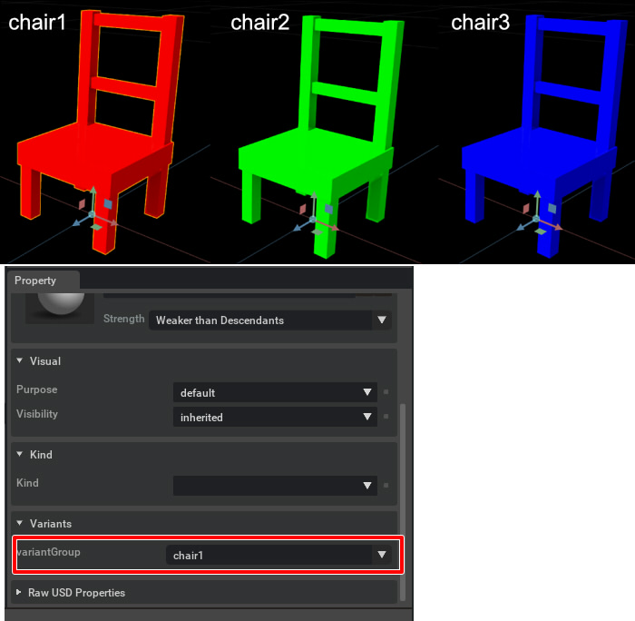

# Variant

PrimのGetVariant( https://graphics.pixar.com/usd/release/api/class_usd_prim.html#a607da249e11bc4f5f3b4bf0db99861ab )を使用して、1つのPrim内で複数のPrimを「VariantSet」として登録します。    

この例の場合は椅子のusdファイル([simple_chair.usda](../Reference/usd/simple_chair.usda))を参照し、色を変えて3つの形状としています。     
      
表示されるのはVariantで指定された1つの形状のみです。    

|ファイル|説明|    
|---|---|    
|[Variant_01.py](./Variant_01.py)|Variantを使ったPrimの切り替えのテスト|    

