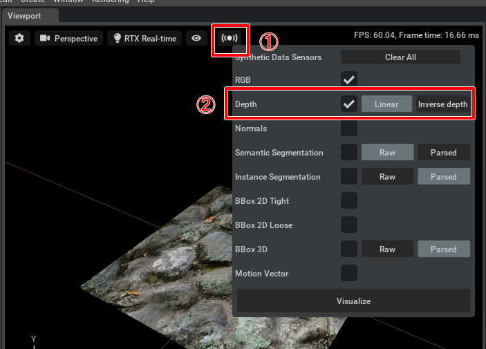

# Capture

レンダリング画像を取得。     

|サンプル|説明|     
|---|---|     
|[CaptureRenderingColor.py](./CaptureRenderingColor.py) |レンダリング画像をファイルに保存|     
|[CaptureRenderingDepth.py](./CaptureRenderingDepth.py)|Synthetic Data Sensorを使用して、レンダリングのDepthをファイル保存。 Extensionの"omni.syntheticdata"をOnにして使用する必要があります。 また、Viewportで"Synthetic Data Sensor"の"Depth"をOnにしておく必要があります。 |     

