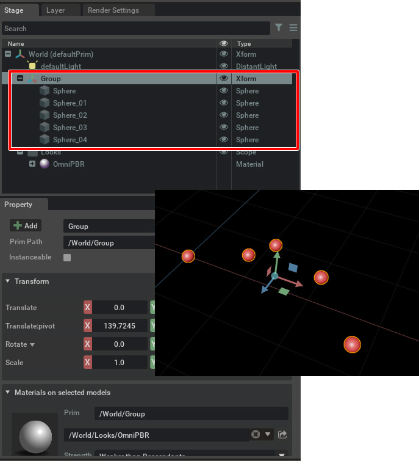
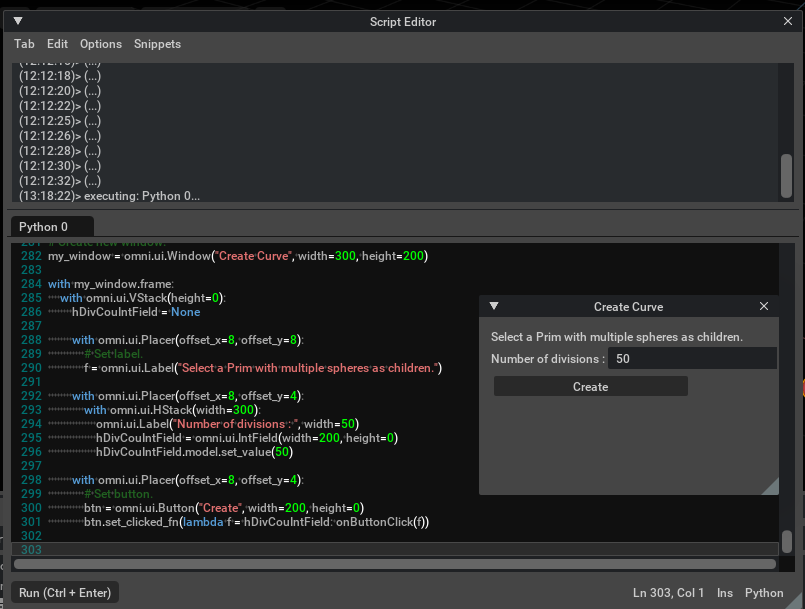

# CreateSimpleCurve

Xform内の複数のSphereを使用し、Spbereをスプライン補間したチューブ形状を作成します。     

## 使い方

複数のSphereを配置します。     
このSphereをつなぐようにスプラインでチューブ形状がMeshとして作成されることになります。     

    

また、Xformに対してマテリアルを割り当てておきます。     

Xformを選択した状態でScript Editorで「[CreateSimpleCurve.py](./CreateSimpleCurve.py)」を実行します。     

Create Curveウィンドウが表示されました。     
    

"Number of divisions"で分割数を指定して"Create"ボタンを押します。     
Sphereを曲線上でつないだチューブ形状がMeshとして生成されます。     
    
    

