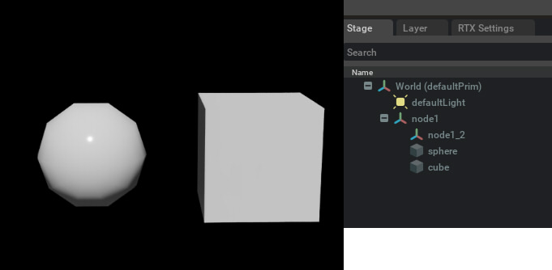

# Scene

|検証|Omniverse Kit|OpenUSD|  
|---|---|---|   
|not yet|v.110.0.0|v.25.11|  

シーン(Stage)の情報を取得/操作します。     

|ファイル|説明|     
|---|---|     
|[StageUpAxis.py](./StageUpAxis.py)|Stageのアップベクトルの取得/設定|     
|[CreateHierarchy.py](./CreateHierarchy.py)|Xformを使って階層構造を作って形状を配置 |     
|[GetAllFacesCount.py](./GetAllFacesCount.py)|シーン内のすべてのMeshの面数を合計して表示。 対象はMesh/PointInstancer。|     
|[TraverseHierarchy.py](./TraverseHierarchy.py)|シーンの階層構造をたどってPrim名を表示。 Meshの場合はMeshの面数も表示。|     
|[Traverse_mesh.py](./Traverse_mesh.py)|Usd.PrimRangeを使ってPrimを取得し、Meshのみを格納|     
|[GetMetersPerUnit.py](./GetMetersPerUnit.py)|metersPerUnitの取得/設定|     
|[NewStage.py](./NewStage.py)|何も配置されていない新しいStageを作成します。 なお、直前のStageの変更は保存されません。|     
|[CloseStage.py](./CloseStage.py)|現在のStageを閉じます。 なお、直前のStageの変更は保存されません。|     
|[OpenUSDFile.py](./OpenUSDFile.py)|指定のUSDファイルを開きます。 なお、直前のStageの変更は保存されません。|     
|[GetResolvedPath.py](./GetResolvedPath.py)|カレントStageで指定されている相対パス（テクスチャやReferenceとして参照しているusdファイルなど）を絶対パスに変換。 存在しないパスを指定した場合は空文字が返る。|     

## レイヤ関連

|検証|Omniverse Kit|OpenUSD|  
|---|---|---|   
|OK|v.110.0.0|v.25.11|  

|ファイル|説明|     
|---|---|     
|[Layers/get_real_path.py](./Layers/get_real_path.py)|Stageで参照されているレイヤの実パスを取得|     
|[Layers/get_sublayers.py](./Layers/get_sublayers.py)|指定レイヤのSubLayer一覧を取得|     
|[Layers/add_sublayer.py](./Layers/add_sublayer.py)|レイヤにサブレイヤを追加する|     
|[Layers/add_sublayer_from_file.py](./Layers/add_sublayer_from_file.py)|既存の（または新規作成した）USDファイルをサブレイヤとして登録するサンプル。 ステージが保存されているディレクトリに`sublayer_from_file.usd`を作成して`rootLayer.subLayerPaths`へ追加します。 `CLEANUP`フラグで変更を破棄（既定: True）または保持（False）できます。|
|[Layers/remove_sublayer.py](./Layers/remove_sublayer.py)|レイヤからサブレイヤを削除する|     
|[Layers/set_sublayer_visibility.py](./Layers/set_sublayer_visibility.py)|サブレイヤの表示/非表示を切り替える （Omniverse Kit のコマンドを `omni.kit.commands.execute` で呼び出します）|     
|[Layers/flatten_sublayers.py](./Layers/flatten_sublayers.py)|サブレイヤをフラット化して統合する （Omniverse Kit のコマンドを `omni.kit.commands.execute` で呼び出します）|     
|[Layers/switch_editing_layer.py](./Layers/switch_editing_layer.py)|編集対象の編集レイヤを切り替える|     
|[Layers/layer_create_edit_revert.py](./Layers/layer_create_edit_revert.py)|レイヤの作成・編集・リバート操作を行う|     