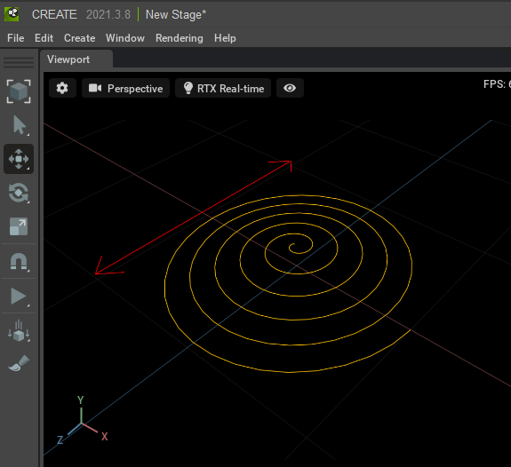

# DebugDraw

|検証|Omniverse Kit|OpenUSD|  
|---|---|---|   
|not yet|v.110.0.0|v.25.11|  

3Dの座標指定で、Depthによる遮蔽を考慮したラインを描画(omni.debugdrawを使用)。     

|ファイル|説明|     
|---|---|     
|[UseDebugDraw.py](./UseDebugDraw.py)|ラインを描画 |     

