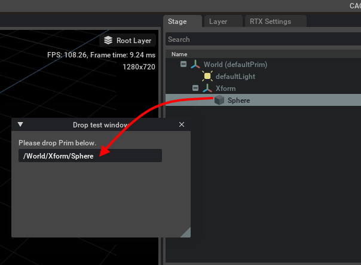

# DragAndDrop

|検証|Omniverse Kit|OpenUSD|  
|---|---|---|   
|not yet|v.110.0.0|v.25.11|  

UI間のドラッグ＆ドロップ。    

|ファイル|説明|     
|---|---|     
|[dropTest.py](./dropTest.py)|Primをウィンドウ内のテキスト領域にドラッグすると、パスが表示される。 |     

