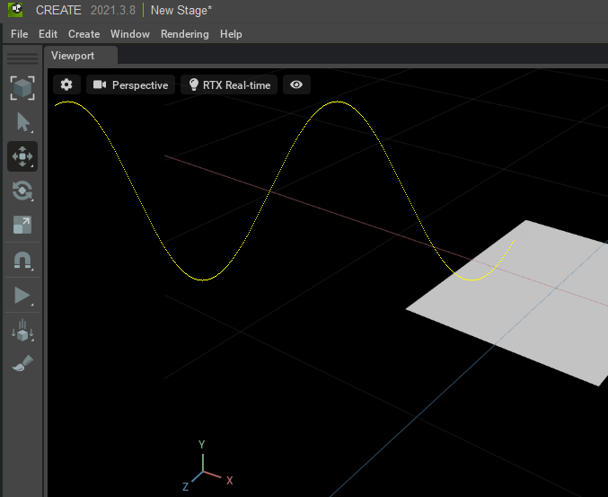
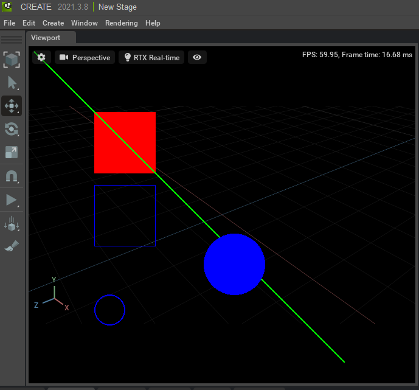

# DrawImage

ビューポートに画像をオーバレイ表示します。     
なお、Omniverse Code(Omniverse Kit 103を使用)では、Omniverse自身のビューポートの実装が大きく進化しているようでした (2022/01/21 確認)。     
そのため、おそらく以下に列挙した描画実装は将来的には不要になると思われます。     

|ファイル|説明|     
|---|---|     
|[drawImage.py](./drawImage.py)|omni.ui.ByteImageProviderを使用して、RGBAバッファに描画したイメージをビューポートにオーバレイ |     
|[drawImageWithPIL.py](./drawImageWithPIL.py)|omni.ui.ByteImageProviderを使用して、PILでの描画をRGBAバッファに送りビューポートにオーバレイ |     

