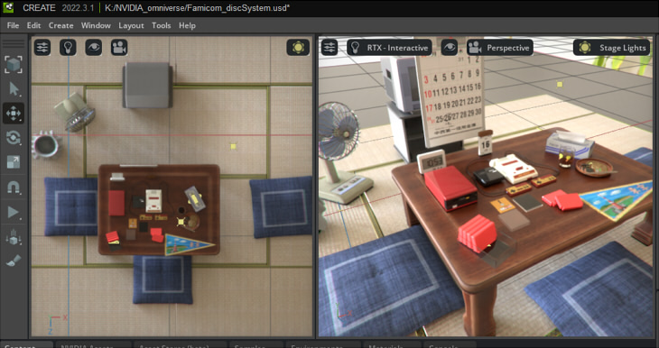
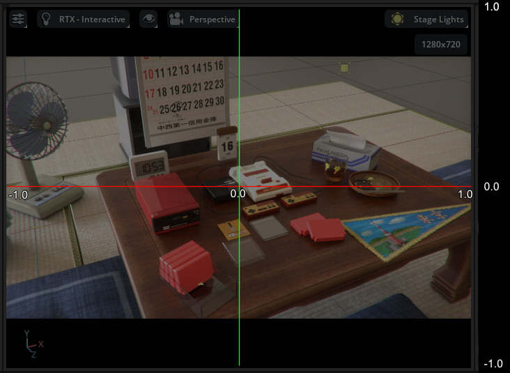
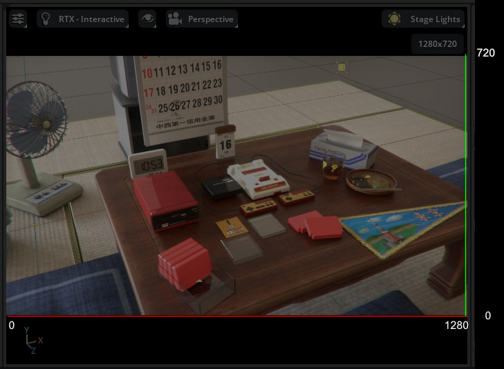
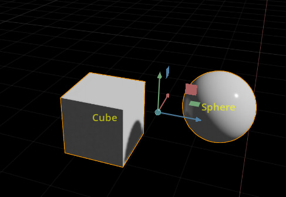
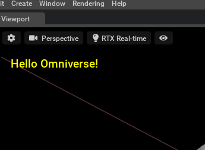
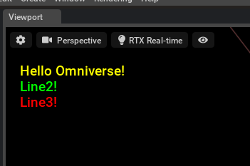
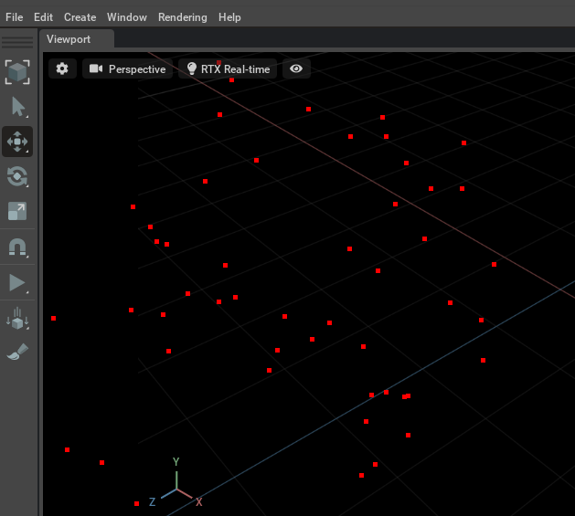
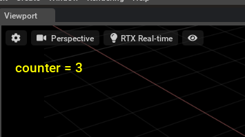
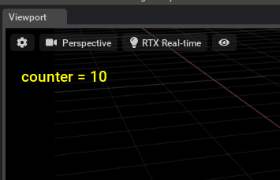

# Viewport

ビューポート上のオーバレイ表示。    
ビューポートの特定位置に2D図形の描画やテキスト描画、3Dのワイヤーフレーム描画などを行います。      
Omniverse Kit.102/103/104で仕様が変わっており、ここではKit.104に沿うようにしています。      

参考 :      
https://docs.omniverse.nvidia.com/kit/docs/omni.kit.viewport.docs/latest/index.html     


## ビューポートは複数持つことができる

Kit.103以降では、複数のビューポートを持てるようになりました（ただし、複数のビューポートは同じレンダラの種類になる）。     
     
クリックして選択したビューポートがアクティブなビューポートとなります。     

以下で、現在のアクティブなビューポートの"viewport_api"を取得できます。     
このクラスからビューポート情報の取得を行うことになります。     
```python
import omni.kit

active_vp_window = omni.kit.viewport.utility.get_active_viewport_window()
viewport_api = active_vp_window.viewport_api
```

## ビューポート名を取得

以下でアクティブなビューポートの名前("Viewport", "Viewport 2"など)を取得します。      

```python
import omni.kit

active_vp_window = omni.kit.viewport.utility.get_active_viewport_window()
print(active_vp_window.name)
```

## 取得できるビューポート情報

「[GetActiveViewportInfo.py](GetActiveViewportInfo.py)」にサンプルを上げています。      
以下のような要素をViewport APIから取得できます。     
以下のほかにも情報を取得できます。     

* カメラのPrim Path ("/OmniverseKit_Persp"など)
* レンダリングの解像度
* ビューポートで使用しているStage
* Projection/Transform/View Matrix

```python
# Get camera path ("/OmniverseKit_Persp" etc).
cameraPath = viewport_api.camera_path.pathString
print("cameraPath : " + cameraPath)

# Resolution.
resolution = viewport_api.resolution
print("Resolution : " + str(resolution[0]) + " x " + str(resolution[1]))

# Stage (Usd.Stage).
print(viewport_api.stage)

# Projection matrix (Gf.Matrix4d).
print(viewport_api.projection)

# Transform matrix (Gf.Matrix4d).
print(viewport_api.transform)

# View matrix (Gf.Matrix4d).
print(viewport_api.view)
```

Viewport APIは以下に詳しい使用例が記載されているので参考になります。     
https://docs.omniverse.nvidia.com/kit/docs/omni.kit.viewport.docs/latest/viewport_api.html     

## レンダラの種類を取得

レンダラの種類は"hydra_engine"と"render_mode"で判断します。     

```python
import omni.kit

active_vp_window = omni.kit.viewport.utility.get_active_viewport_window()
viewport_api = active_vp_window.viewport_api

print(viewport_api.hydra_engine)
print(viewport_api.render_mode)
```

以下のように取得できました。     

|レンダラの種類|hydra_engine|render_mode|    
|---|---|---|    
|RTX-Real-Time|rtx|RaytracedLighting|    
|RTX-Interactive (Path Tracing)|rtx|PathTracing|    
|RTX Accurate (Iray)|iray|iray|    
|Pixar Storm|pxr|HdStormRendererPlugin|    


## ワールド座標からスクリーン座標への変換 (Space Mapping)

「[WorldToScreen.py](WorldToScreen.py)」にサンプルを上げています。      
上記以外の機能として、ワールド座標上の位置をスクリーンの2D座標に変換してくることができます(この逆も可能)。     
これと"omni.ui.scene"を使うことで、ビューポートへのオーバーレイ描画を容易に行うことができます。      

```python

# World to NDC space (X : -1.0 to +1.0, Y : -1.0 to +1.0).
p = (0, 0, 0)
p_screen = viewport_api.world_to_ndc.Transform(p)

# NDC to Pixel space.
sPos, in_viewport = viewport_api.map_ndc_to_texture_pixel(p_screen)
if in_viewport:
    print(sPos)
```
Viewport APIはビューポートの情報を取得したり計算結果を返す役割になります。     
描画は"omni.ui.scene"で行う、という役割分担になります。     

### NDC space

"NDC space"は、ビューポート全体をX方向に-1.0から+1.0、Y方向に-1.0から+1.0としたときの座標系です。      
     

### Pixel space

"Pixel space"は、ビューポートのレンダリング画像内のピクセル座標です。    
これはViewport APIの"resolution"で取得できる解像度の範囲のピクセル位置を表します。     
以下は解像度が1280 x 720ピクセルの場合のPixel spaceの例です。     
     

## omni.ui.sceneを使用してビューポートにオーバレイ描画

ビューポートへのオーバレイ描画は"omni.ui.scene"を使用します。     
サンプルExtension"[ft_lab.sample.uiSceneShowPrimName](../../Extensions/ft_lab.sample.uiSceneShowPrimName)"は、選択したPrimの名前をビューポートに表示する簡単な例です。      
       

```python
from omni.ui import scene as sc
import omni.kit

# Get active viewport.
active_vp_window = omni.kit.viewport.utility.get_active_viewport_window()
viewport_api = active_vp_window.viewport_api

# Get viewport window.
viewport_name = active_vp_window.name   # "Viewport", "Viewport 2" etc.
self._window = omni.ui.Window(viewport_name)

with self._window.frame:
    with omni.ui.VStack():
        # The coordinate system is NDC space.
        # (X : -1.0 to +1.0, Y : -1.0 to +1.0).
        self._scene_view = sc.SceneView(aspect_ratio_policy=sc.AspectRatioPolicy.STRETCH)

        with self._scene_view.scene:
            self._sceneDraw = SceneDraw(self._viewport_api)

            # Update drawing.
            self._sceneDraw.invalidate()
```

"omni.ui.Window"の第一引数に渡すビューポート名は、マルチビューポートに対応するため「アクティブなビューポート名」を取得する必要があります。     
"omni.kit.viewport.utility.get_active_viewport_window()"で取得したクラスからnameを取得することで、アクティブなビューポート名を得ることができます。      

ビューポートウィンドウにオーバレイするためにSceneViewを作成します。      
"sc.SceneView"の引数でAspect ratioをSTRETCHとします。     
これでNDC space(X : -1.0 to +1.0, Y : -1.0 to +1.0)の座標系になります。      
また、SceneDrawクラスを作成するときに第一引数にViewport APIを渡しています。     

SceneDrawクラスは以下のように記載しました。      
```python
class SceneDraw (sc.Manipulator):
    _viewport_api = None

    def __init__(self, viewport_api, **kwargs):
        super().__init__ (**kwargs)

        # Set Viewport API.
        self._viewport_api = viewport_api

    # -------------------------------------------.
    # Repaint.
    # -------------------------------------------.
    def on_build (self):
        stage = omni.usd.get_context().get_stage()

        # Get selection.
        selection = omni.usd.get_context().get_selection()
        paths = selection.get_selected_prim_paths()

        time_code = Usd.TimeCode.Default()
        xformCache = UsdGeom.XformCache(time_code)

        for path in paths:
            prim = stage.GetPrimAtPath(path)
            if prim.IsValid():
                # Get world Transform.
                globalPose = xformCache.GetLocalToWorldTransform(prim)

                # Decompose transform.
                translate, rotation, scale = UsdSkel.DecomposeTransform(globalPose)

                # World to NDC space (X : -1.0 to +1.0, Y : -1.0 to +1.0).
                ndc_pos = self._viewport_api.world_to_ndc.Transform(translate)

                # Translation matrix.
                moveT = sc.Matrix44.get_translation_matrix(ndc_pos[0], ndc_pos[1], 0.0)

                # Draw prim name.
                with sc.Transform(transform=moveT):
                    sc.Label(prim.GetName(), alignment = omni.ui.Alignment.CENTER, color=cl("#ffff00a0"), size=20)
```
"self._sceneDraw.invalidate()"の指定により"on_build"が呼ばれます。      
現在のStageから選択されたprimを取得し、"globalPose = xformCache.GetLocalToWorldTransform(prim)"でワールド座標の変換行列を取得。      
"UsdSkel.DecomposeTransform"で移動(translate)、回転(rotation)、スケール(scale)に分解します。      
Viewport APIの"self._viewport_api.world_to_ndc.Transform(translate)"でtranslateをワールド座標からNDC座標に変換します。      

"sc.Matrix44.get_translation_matrix"を使ってNDC座標の位置を行列に変換。      
"with sc.Transform(transform=moveT)"でこのときの位置を中心にsc.Labelでラベルを配置しています。       

これはオーバーレイの描画を行う流れになり、これ以外に以下のイベントを取得して"self._sceneDraw.invalidate()"で更新する必要があります。      

* Primが移動した場合(Transformの変更)
* 選択Primが変更された場合
* ビューポートのカメラが変更された場合
* アクティブなビューポートが変更された場合

これらについては、"[ft_lab.sample.uiSceneShowPrimName](../../Extensions/ft_lab.sample.uiSceneShowPrimName)"のExtensionをご参照くださいませ。       


## キャプチャ

その他、レンダリング画像のキャプチャ機能があります。     
※ まだ未記載。     

## サンプル

|ファイル|説明|     
|---|---|     
|[DrawText.py](./DrawText.py)|ビューポートにテキストを描画<br><br>単一ビューポートのみ考慮。|     
|[DrawText2.py](./DrawText2.py)|ビューポートに複数行のテキストを描画<br><br>単一ビューポートのみ考慮。|     
|[DrawRandomRect.py](./DrawRandomRect.py)|ビューポートにランダムに小さい矩形を描画<br><br>単一ビューポートのみ考慮。|     
|[UpdateText.py](./UpdateText.py)|ビューポートに10秒間カウントアップするテキストを描画。<br>asyncio.ensure_future()でタスクを起動。<br>await asyncio.sleep(1) で待つ<br><br>単一ビューポートのみ考慮。|     
|[UpdateText2.py](./UpdateText2.py)|ビューポートにカウントアップするテキストを描画。<br>time.time()で1秒の間隔ごとに更新。<br><br>単一ビューポートのみ考慮。|     
|[UpdateDrawImage.py](./UpdateDrawImage.py)|"omni.ui.ImageWithProvider"を使用して、ファイルから読み込んだ画像をビューポートに表示します。<br>"omni.kit.app.get_app().get_update_event_stream().create_subscription_to_pop"使用時は omni.ui.Imageでの描画がうまく反映されないようなのでそれの変わりです。<br>単一ビューポートのみ考慮。|   
|[GetViewportRect.py](./GetViewportRect.py)|Kit.103までの動作。Kit.104では使用できません。<br>ビューポートの矩形情報を取得<br>単一ビューポートのみ考慮。|     
|[GetActiveViewportInfo.py](./GetActiveViewportInfo.py)|アクティブなビューポートの情報を取得(omni.kit Viewport API)|     
|[WorldToScreen.py](./WorldToScreen.py)|ワールド座標位置からスクリーン上の位置に変換(omni.kit Viewport API)|     


