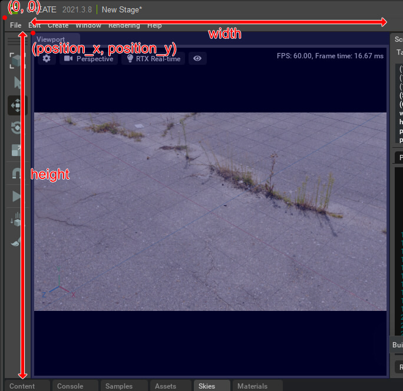
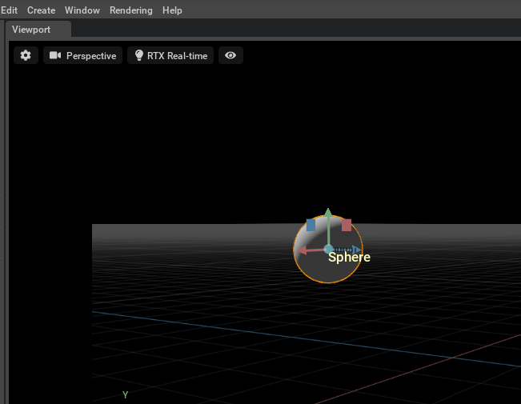

# Viewport

ビューポート上のオーバレイ表示。    
Omniverse Kit Ver.102での内容になります。     

なお、Omniverse Kit Ver.103ではビューポート周りはより扱いやすく整理されているため、このあたりは今後使わなくなるのかもしれません。    

## ビューポートの位置とサイズ

※ Omniverse Kit Ver.102までで使えます。Ver.103では使用できませんでした。    

以下のように実行すると、ビューポートの矩形情報を取得できます。     
```python
import omni.kit

viewportI = omni.kit.viewport_legacy.acquire_viewport_interface()
vWindow = viewportI.get_viewport_window(None)

vwRec = vWindow.get_viewport_rect()
```
※ Kit102では「omni.kit.viewport」でしたが、Kit103では「omni.kit.viewport_legacy」になっています。     

このときの「vwRec」をビューポートの矩形とします。    
メインメニューの左上を(0, 0)として原点とし、相対位置として
(vwRec[0], vwRec[1]) - (vwRec[2], vwRec[3]) がビューポートの左上と右下の座標となります。      
      

## omni.ui.Workspaceでの位置とサイズ

※ Omniverse Kit Ver.102までで使えます。Ver.103では使用できませんでした。    

「omni.ui.Workspace」からビューポートを取得した場合、ビューポートウィンドウ全体（上部のキャプション部も含む）の位置を(position_x, position_y)、ウィンドウサイズを(width, height)で取得できます。    
この場合も、メインメニューの左上を(0, 0)とした相対位置になります。    

```python
import omni.ui

uiViewportWindow = omni.ui.Workspace.get_window("Viewport")
wid = uiViewportWindow.width
hei = uiViewportWindow.height
posX = uiViewportWindow.position_x
posY = uiViewportWindow.position_y
```
      

## サンプル

|ファイル|説明|     
|---|---|     
|[DrawText.py](./DrawText.py)|ビューポートにテキストを描画<br>|     
|[DrawText2.py](./DrawText2.py)|ビューポートに複数行のテキストを描画<br>|     
|[DrawRandomRect.py](./DrawRandomRect.py)|ビューポートにランダムに小さい矩形を描画<br>|     
|[UpdateText.py](./UpdateText.py)|ビューポートに10秒間カウントアップするテキストを描画。<br>asyncio.ensure_future()でタスクを起動。<br>await asyncio.sleep(1) で待つ<br>|     
|[UpdateText2.py](./UpdateText2.py)|ビューポートにカウントアップするテキストを描画。<br>time.time()で1秒の間隔ごとに更新。<br>|     
|[UpdateDrawImage.py](./UpdateDrawImage.py)|"omni.ui.ImageWithProvider"を使用して、ファイルから読み込んだ画像をビューポートに表示します。<br>"omni.kit.app.get_app().get_update_event_stream().create_subscription_to_pop"使用時は omni.ui.Imageでの描画がうまく反映されないようなのでそれの変わりです。|   
|[GetViewportRect.py](./GetViewportRect.py)|ビューポートの矩形情報を取得|     
|[DrawPrimName.py](./DrawPrimName.py)|選択形状の中央にPrim名を表示。<br>選択されたPrimのワールドポジションをスクリーン座標に変換。<br>ビューポート上の座標に変換して"omni.ui.Label"でテキストを描画しています。<br>|     

