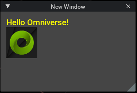
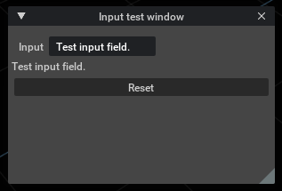

# Window

ウィンドウを作成。    

|ファイル|説明|     
|---|---|     
|[CreateNewWindow.py](./CreateNewWindow.py)|新しいウィンドウを作成。<br>|     
|[ImageWindow.py](./ImageWindow.py)|イメージをウィンドウ内に表示。<br>|     

イメージは「kit」をカレントパスとして指定します。     
Extensionで絶対パスを指定する場合は、以下のように指定します。      

```python
from pathlib import Path

IMAGE_PATH = Path(__file__).parent.parent.joinpath("images")

imagePath = f"{IMAGE_PATH}/xxxx.png"

omni.ui.Image(imagePath, width=64, height=64, fill_policy=omni.ui.FillPolicy.PRESERVE_ASPECT_FIT, alignment=omni.ui.Alignment.LEFT_CENTER)
```

|ファイル|説明|     
|---|---|     
|[InputField.py](./InputField.py)|omni.ui.StringFieldを使った入力フィールド。<br>|     
    
