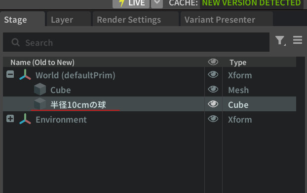
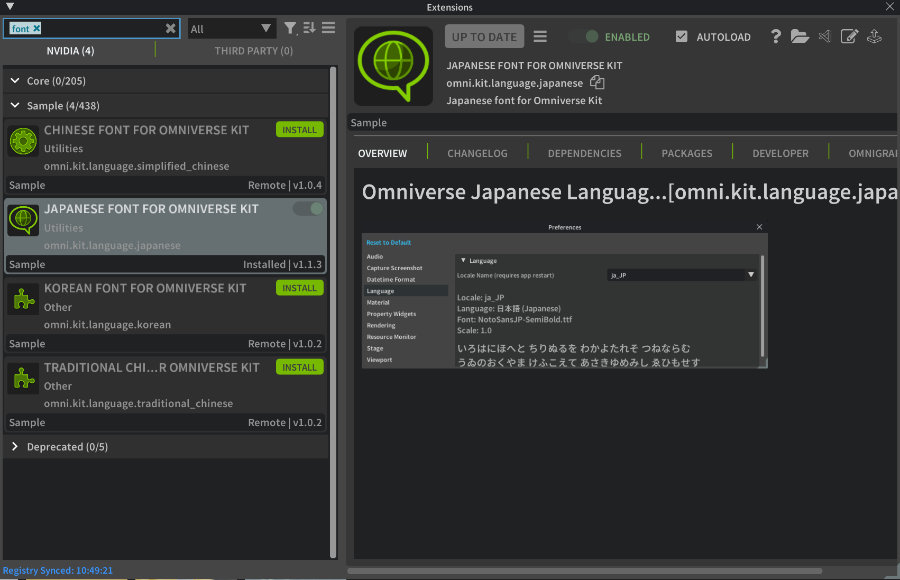
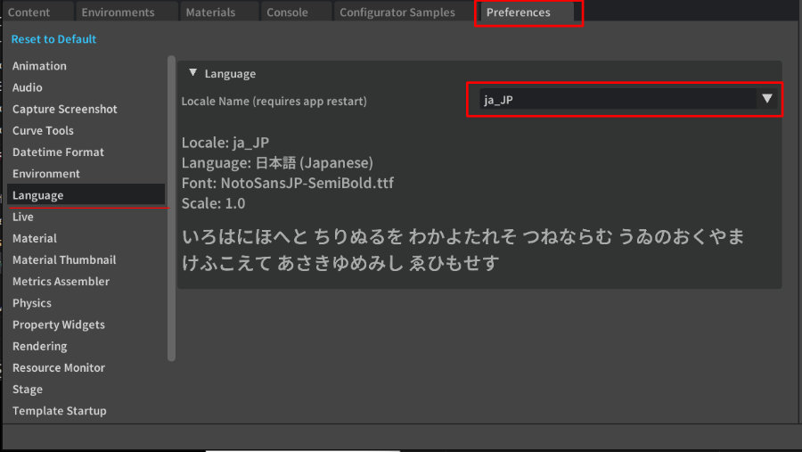

## Omniverse Kit上での言語指定

  

Omniverse Kit上では初期状態では英語の表示のみに対応しています。  
別途、
言語ごとにExtensionを経由したフォント指定を行うことで言語を表示できるようになります。  

Kit 109.0.2では、日本語/韓国語/中国語(簡体字, 繁体字)を指定でき、個別に切り替える必要があります。  
Extensionウィンドウで"font"の文字列で検索してみてください。  

  

|Extension名|説明|  
|---|---|  
|omni.kit.language.japanese|日本語|  
|omni.kit.language.simplified_chinese|中国語(簡体字)|  
|omni.kit.language.traditional_chinese|中国語(繁体字)|  
|omni.kit.language.korean|韓国語|  

これらのExtensionをインストールしておきます。  
次の手順を行うことでKit上の言語が反映されます。  

## 言語の指定を行う

Omniverse Kitを再起動後に、メインメニューからEdit - Preferencesを選択します。  
Preferencesウィンドウで"Language"が表示されています。  
ここで"Locale Name"を選択できます。
デフォルトは"en_US"になっており、Extensionとしてのomni.kit.languageのインストールにより言語が追加されているのが確認できます。  
  

これを切り替えてKitを再起動することでフォントが反映されます。  
