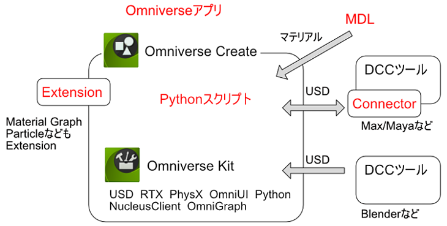

# Omniverseでの開発手段

OmniverseはここでサンプルとしてアップしているPythonスクリプト以外に、    
スクリプトを機能ごとにまとめてモジュール化した「Extension」、      
外部ツールから3DモデルをUSDを経由して連携する「Connector」、     
アプリケーション自身の「Omniverse App」があります。     
    

Pythonスクリプトを機能別にまとめてモジュール化したものがExtensionになります。     
複数のExtensionを組み合わせて目的別にアプリケーション化したものがOmniverse CreateやOmniverse Viewなどのアプリになります。     
サードパーティでもOmniverseアプリは開発できます。     

また、C/C++言語を使用して「Connector」を実装することにより、
外部の3DCGツールとUSDを介して連携できます。    
USD SDKでは、Pythonのモジュール/メソッドと、C/C++言語のクラスや関数は1対1で対応しています。    
そのため、PythonスクリプトでUSDを操作できるようになればConnectorを実装する際にはそのままその知識は活かせるようになるかと思います。    

Omniverse上でのマテリアル表現は、USD標準のUsdPreviewSurface、OmniPBR、OmniSurfaceが使用されます。     
これらでもかなりのマテリアル表現ができますが、
MDL(Material Definition Language : マテリアル定義言語)を使うことで、よりマテリアルを自由にカスタマイズすることができるようになります。    

MDLについては、「NVIDIA MDL SDK - Get Started」にかなり詳しく情報があります。      

https://developer.nvidia.com/mdl-sdk

このような感じで、Omniverseはあらゆる個所をカスタマイズしていくことができるようになっています。      
それぞれは範囲が膨大になるため、まずはOmniverse CreateのScript Editor上でスクリプトを使ってシーンを制御できるようになる、というのが入口としてちょうどよさそうです。     

