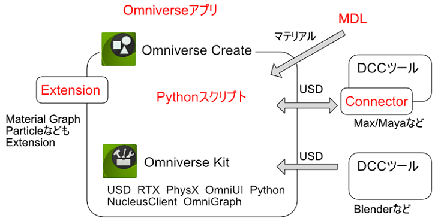

# Omniverseでの開発手段

OmniverseはここでサンプルとしてアップしているPythonスクリプト以外に、    
スクリプトを機能ごとにまとめてモジュール化した「Extension」、      
外部ツールから3DモデルをUSDを経由して連携する「Connector」、     
アプリケーション自身の「Omniverse App」があります。     
    

※2026/03:  
現状Connectorを使用するよりも、OpenUSD Exchange SDK (https://docs.omniverse.nvidia.com/usd/code-docs/usd-exchange-sdk/latest/index.html) とOpenUSDを使用したUSDのエクスポート/インポートで実装する流れになっています。  
この場合はOmniverse Kitから離れて、いったんusdファイルをエクスポートする必要があります。  

Pythonスクリプトを機能別にまとめてモジュール化したものがExtensionになります。     
複数のExtensionを組み合わせて目的別にアプリケーション化したものがUSD ComposerやIsaac Simなどのアプリになります。     
サードパーティでもOmniverseアプリは開発できます。     

また、「[OpenUSD Exchange SDK](https://docs.omniverse.nvidia.com/usd/code-docs/usd-exchange-sdk/latest/index.html)」をライブラリとして使用し、C++言語またはPythonを使用して「USDへのコンバータ」を書く手段が用意されています。   
※ Connector的な機能はOpenUSD Exchange SDKを使って実装することが推奨されています。

なお、OpenUSD Exchange SDKを使う場合はOpenUSDに対する知識が必要です。  
OpenUSD Exchange SDKはOpenUSDで手間のかかる実装をアクセスしやすくする機能を提供します。 

外部の3DCGツールとの連携はUSDファイルを経由して行います。 
ただし、OmniverseのConnect SDK(Connect Sample)にあったような、Live Syncの機能はOpenUSD Exchange SDKでは持っていません。  

Omniverse上でのマテリアル表現は、USD標準のUsdPreviewSurface、OmniPBR、OmniSurfaceが使用されます。     
これらでもかなりのマテリアル表現ができますが、
MDL(Material Definition Language : マテリアル定義言語)を使うことで、よりマテリアルを自由にカスタマイズすることができるようになります。    
OmniPBR、OmniSurfaceも固定(プリセット)のMDLで実装されている構成になります。       
MDLは他の3DCGエンジンで言う「Shader」に近い存在です。       

MDLについては、「NVIDIA MDL SDK - Get Started」に詳しい情報があります。      

https://developer.nvidia.com/mdl-sdk

2026年3月現在は Omniverse Kit上でMaterialXを使ったマテリアルもサポートしています。  
UsdPreviewSurfaceよりもリッチなマテリアルを期待したい場合、Shader的なマテリアルのカスタマイズを行いたい場合は`MaterialX`を使うほうがいいかもしれません。
MaterialXは広く他のDCCツールやWebフレームワークでも使用されています。  

https://materialx.org/

このような感じで、Omniverseはあらゆる個所をカスタマイズしていくことができるようになっています。   
それぞれは範囲が膨大になるため、まずはUSD ComposerのScript Editor上でスクリプトを使ってシーンを制御できるようになる、というのが入口としてちょうどよいかもしれません。     

