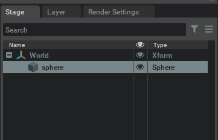

# USDについての情報

USD(Universal Scene Description )はPixar社が提供している3Dのシーンを管理するファイルフォーマットです。     
オープンソースとして公開されています。     

https://graphics.pixar.com/usd/release/index.html

API Documentation :     
https://graphics.pixar.com/usd/release/api/index.html    

DCCツール間で3Dモデルやシーンをやりとりする中間ファイルとしての使用、大規模シーンの管理に向いています。      
PythonやC++のAPIやビュワー（usdview）、usdファイル変換を行うコマンドラインツールなどが用意されており、アプリケーションに組み込むための機能が豊富にあります。     
USDはファイルフォーマットとしてだけでなく、データ構造を表現するシステムとして大きな存在になっています。     
iOS/iPadOSのAR(AR Quick LookやReality Composer)でも使用されています。     
Omniverseではアセットやシーンすべての標準ファイルフォーマットとしてUSDを使用されています。    

USDを使った開発については以下にもまとめ中です。    

https://github.com/ft-lab/Documents_USD


## USDファイルの種類

USDファイルは、以下のものが存在します。     

|USDファイルの拡張子|説明|
|---|---|
|usda|テキストファイル|
|usd/usdc|バイナリファイル|
|usdz|usdファイルとイメージファイルを1つのファイルにしたもの|

usdaとusd/usdcファイルは、テキストとバイナリで異なりますが同じ内容を記載できます。     
バイナリファイルのほうがファイルサイズを小さくできます。     

usdファイルはテクスチャとしてイメージファイル(png/jpeg/exrなど)を参照します。     
複数のusdファイルやイメージファイルをまとめたものが「usdz」というファイルになります。    
これは無圧縮のzip形式です。     

## USDの構成

USDは以下のように記述されます。     
以下はusdaというテキストファイルです。     
```
#usda 1.0

def Xform "World"
{
    def Sphere "sphere"
    {
        color3f[] primvars:displayColor = [(0, 0, 1)]
        double radius = 1.0
    }
}
```

この場合は、半径1.0(cm)の球を原点の位置に青色で配置します。     
```
def Type名 "Prim名"
{
}
```
として1つの要素（Primと呼ばれます）が定義されます。     
「Xform」は空のNULLノード相当。    
その子として「Sphere」の球が配置されています。     
Omniverse上では以下のように表示されました。     
    

このとき、"/World/sphere"が「Path」として表現されます。Stage上での絶対パス指定になります。      
このPathはUSD内で重複はできません。     
もし、同一Pathで形状を作成した場合は上書きされます。     

たとえば以下のようにPythonを書いてみました。     
Sphereを生成しそのあとに同一パスでCubeを生成すると、SphereはCubeに置き換えられます。     
```python
from pxr import Usd, UsdGeom, UsdPhysics, UsdShade, Sdf, Gf, Tf

# Get stage.
stage = omni.usd.get_context().get_stage()

# Create sphere.
pathName = '/World/xxx'
sphereGeom = UsdGeom.Sphere.Define(stage, pathName)

# Create Cube.
cubeGeom = UsdGeom.Cube.Define(stage, pathName)

# Set cube size.
cubeGeom.CreateSizeAttr(10.0)
```

## Primの名前

Prim名は記載ルールがあります。     

* ASCIIの英数字、アンダーバーで構成 (日本語は使用できません)
* 先頭の文字は、数値を指定できません。
* 同一階層に同一Prim名を指定できません。

例えば、「球体」「9ABC」「AB-CD」などはPrim名として指定できません。     

プログラムでの変数名のような命名ルールです。     
そのため、これに沿っていない名前をusdに入れたい場合はPrim名をあらかじめ変更して格納する必要があります。     
Omniverseにこれらのルールに沿わない文字を無理やり入れた場合は、無効な文字は「_」（アンダーバー）に置き換えられます。      

