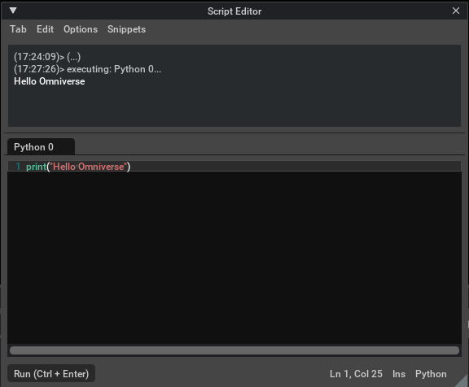

# Omniverse sample scripts

This is a collection of sample scripts that run in the script window on NVIDIA Moniverse Create.     
It is also for learning to write USD using Python.     

Confirmed with Omniverse Create 2021.1.    

## Overview

In Omniverse, select [Window] - [Script Editor] from the main menu to display the Script Editor window.     

    

It is written in the Python language.    

## Comment

Comments are specified with a "#" at the beginning of the line.     
```
# comment.
```

## print

The print to be used for debugging is specified as follows.     
```
print('Hello Omniverse !')
```

## Samples

|Sample|Description|     
|---|---|     
|[Math](./Math/readme.md)|Vectors and matrix calculations.|    
|[Geometry](./Geometry/readme.md)|Sample for creating geometry.|    
|[Camera](./Camera/readme.md)|Camera operation.|    
|[Prim](./Prim/readme.md)|Manipulate Prim (Node) in USD.|    
|[Material](./Material/readme.md)|Sample material settings.|    
|[Scene](./Scene/readme.md)|Sample for getting scene information.|    
|[Physics](./Physics/readme.md)|This is a sample of Physics.|    
|[UI](./UI/readme.md)|Sample of UI operation.|    
|[Operation](./Operation/readme.md)|Ominverse operations.|    
|[Event](./Event/readme.md)|Get the event.|    
