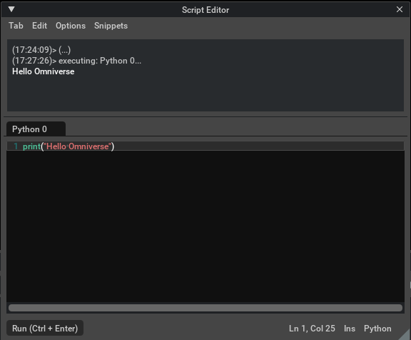

# Omniverse sample scripts

ここでは、NVIDIA Omniverse ( https://www.nvidia.com/ja-jp/omniverse/ ) のスクリプトのサンプルを貯めていってます。       
Omniverseは、データ構造として[OpenUSD](https://openusd.org/release/index.html)を使用してます。     
3Dモデルやシーンのファイルへの保存、読み込みでUSDが使用されるだけでなく、    
Omniverse Kitをベースとしてアプリ(USD ComposerやIsaac Sim)のビュー上の制御もUSDを介して行われます。  
形状の表示/非表示の切り替えや移動など、これらはUSDの汎用的な操作を介して行います。  

ここでは、OmniverseアプリであるOmniverse USD ComposerのScript Editorで試せるスクリプトのサンプルを用途別に列挙します。     
Omniverse Kit 110.0.0で確認(WIP: 検証中、、、)しました。  

## 開発の参考サイト

Omniverse開発環境は [kit-app-template](https://github.com/NVIDIA-Omniverse/kit-app-template) を使います。  
このGitHubのリポジトリの手順に従ってOmniverse Kit環境を構築することができます。 
kit-app-templateは、Omniverse Kitをベースとしてひな型アプリを作成することができます。  
検証にはこのkit-app-templateからビルドできる"USD Composer"がよく使用されます。  

シミュレーション環境に特化した `Isaac Sim` (5.1.0)は以下のURLをご参照くださいませ。  

https://docs.isaacsim.omniverse.nvidia.com/5.1.0/index.html

Isaac SimもOmniverse Kitをベースに開発されています。

### Omniverse Developer Overview

https://docs.omniverse.nvidia.com/dev-overview/latest/index.html

Omniverse開発の入口となるサイトです。     
全体的に何ができて何が重要か、というのは俯瞰して見ることができます。      

### Learn OpenUSD

OpenUSDを学ぶサイトです。  

https://docs.nvidia.com/learn-openusd/latest/index.html


### kit-app-template

https://docs.omniverse.nvidia.com/kit/docs/kit-app-template/latest/docs/intro.html 

Omniverse Kit SDKのトップページです。   

## はじめに

Omniverse USD Composerで、メインメニューの [Developer] - [Script Editor]を選択して、Script Editorを起動します。     

    

この中でPythonを使用してプログラムを書きます。    
左下のRunボタンを押すか、[Ctrl] +[Enter]キーを押すことで実行します。      

以下、Pythonの初歩的な説明です。     

### コメント

1行のコメントの場合、"#"から行の末尾までがコメントになります。     
```python
# comment.
```

複数行の場合は、""" から """ までがコメントになります。     
```python
"""
comment.
line2.
"""
```

### print

デバッグ用のメッセージはprintで記載します。     
```python
print("Hello Omniverse !")
```

## 学習のための知識

* [Omniverseでの開発手段](./knowledge/dev_method.md)
* [Omniverseのスクリプトの学習手順](./knowledge/dev_info.md)
* [USDについての情報](./knowledge/dev_usd.md)
* [kit-app-template](./knowledge/kit-app-template.md)

その他の知識は [Knowledge](./knowledge/) に蓄えていく予定です。  

## Pythonの基礎的なこと

|サンプル|説明|     
|---|---|     
|[Python](./Python)|Pythonの文字列処理やクラスなど。<br>Pythonの標準機能。|    

## 機能説明用のサンプル

|サンプル|説明|     
|---|---|     
|[Audio](./Audio)|Audioの再生|    
|[Animation](./Animation)|Animation関連|    
|[Camera](./Camera)|カメラ操作|    
|[Geometry](./Geometry)|ジオメトリの作成/情報取得|    
|[Light](./Light)|光源の作成/操作|    
|[Material](./Material)|マテリアルの割り当て|    
|[Math](./Math)|ベクトル/行列計算関連|    
|[Operation](./Operation)|Ominverseの操作/イベント処理|    
|[Event](./Event)|イベント処理|    
|[Physics](./Physics)|Physics(物理)処理|    
|[pip_archive](./pip_archive)|Pythonのよく使われるモジュールの使用|    
|[Prim](./Prim)|USDのPrim(ノード)の操作|    
|[Rendering](./Rendering)|レンダリング画像の取得|    
|[Scene](./Scene)|シーン(Stage)情報の取得/読み込みなど|    
|[Settings](./Settings)|設定の取得|    
|[System](./System)|システム関連情報の取得|    
|[UI](./UI)|UI操作|    
|[Post Processing](./PostProcessing)|Post Processingのパラメータを変更 (omni.kit.commands.executeを使用)|    
|[AssetConverter](./AssetConverter)|obj/fbx/glTFファイルなどをUSDファイルに変換|    
|[Nucleus](./Nucleus)|Nucleus上のファイル操作|    

## プロジェクト別のサンプル

|サンプル|説明|     
|---|---|     
|[PLATEAU](./PLATEAU)|Project PLATEAUの3D都市データをOmniverseに読み込み|    

## ツール的なサンプル

|サンプル|説明|     
|---|---|     
|[Samples](./Samples)|サンプルスクリプト|    

## Extension

|サンプル|説明|     
|---|---|     
|[Extensions](./Extensions)|サンプルExtension|    
